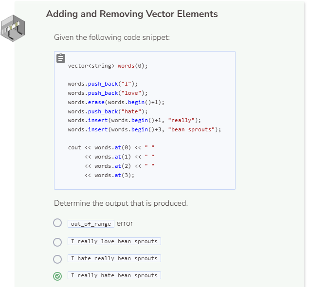
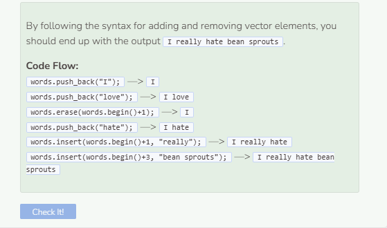

# Adding and Removing Elements
## Adding Vector Elements
To add elements to the vector, simply use the `push_back()` function. The `push_back()` function will add whatever element that is specified inside parentheses `()` to the end of the vector. If an element is added to an empty vector such as `vector<int> numbers(0)`, that element will be the first and only element in the vector.

Note that the `push_back()` function does not replace elements.

Arrays are strict when it comes to data type compatibility, however, vectors are more flexible. Between the four common data types, string is the only type that cannot be associated with the other three in a vector. Integers, doubles, and booleans are all compatible with each other. Remember, in C++, true is 1 and false is 0.

To add an element to a specific index in the vector, you can use the `insert()` along with the `begin()` functions like below.

```cpp
vector<int> numbers(2);
numbers.insert(numbers.begin()+1, 50); //add 50 to index 1
cout << numbers.at(0) << endl;
cout << numbers.at(1) << endl;
cout << numbers.at(2) << endl;

numbers.insert(numbers.begin()+1, 100); //add 100 to index 1
cout << numbers.at(0) << endl;
cout << numbers.at(1) << endl;
cout << numbers.at(2) << endl; //50 now becomes index 2
```

In addition, when doubles are converted into integers, their decimal value get eliminated. This is why pushing 50.99 into an int vector causes it to turn into 50 without the decimal value.

The `begin()` function always refer to the first position in the vector, which is also the 0th index. If you want to refer to the 1st index, use `begin()+1`. For the 2nd index, use `begin()+2`, so on and so forth.

## Removing Vector Elements
To remove an element from the end of a vector, use the `pop_back()`. Note that using `pop_back` will remove the element and its index, thus decreasing the size of the vector by 1.

To remove an element from a specific index in the vector, use the `erase()` function and specify the index you want to erase with `begin()`. When an element and its index is removed from the vector, all of the elements to its right will be moved one place to the left.


