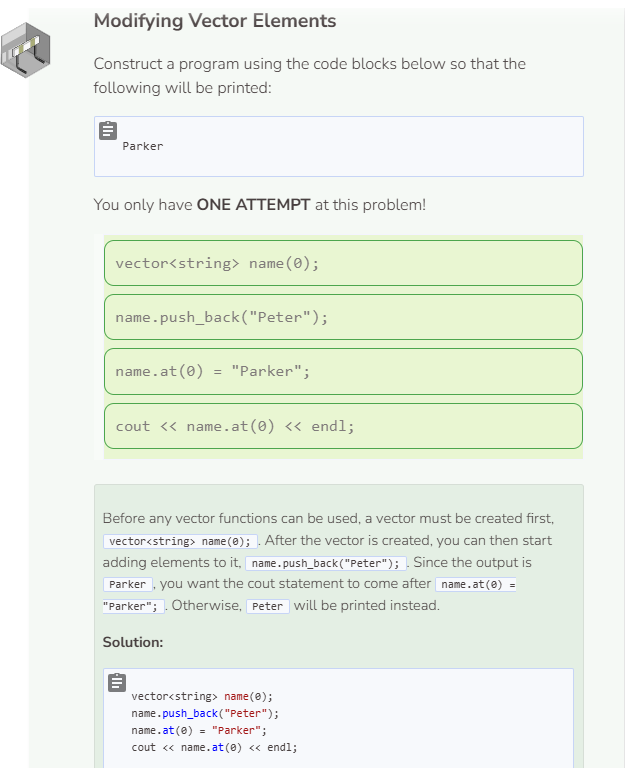

# Modifying Elements
## Modifying Vector Elements
To modify vector elements, use the `at()` method to specify the index number and then assign a new element to it.

```cpp
vector<string> contact(0);
contact.push_back("First name");
contact.push_back("Last name");
contact.push_back("Phone number");
cout << contact.at(0) << " " 
     << contact.at(1) << " " 
     << contact.at(2) << endl;

contact.at(2) = "Email"; //change element at index 2 to "Email"
cout << contact.at(0) << " " 
     << contact.at(1) << " " 
     << contact.at(2) << endl;
```

## Initializing Vector Elements
It is possible to initialize elements inside a vector without constantly using `push_back()`. The following code will produce the same result as the original code above.

```cpp
vector<string> contact{"First name", "Last name", "Phone number"};
cout << contact.at(0) << " " 
     << contact.at(1) << " " 
     << contact.at(2) << endl;

contact.at(2) = "Email"; //change element at index 2 to "Email"
cout << contact.at(0) << " " 
     << contact.at(1) << " " 
     << contact.at(2) << endl;
```

When initializing elements within a vector, you do not specify the number of elements in parentheses. The system will automatically know how many elements are being added to the vector. The initialized elements should be in curly braces `{}` and separated by commas `,`.

