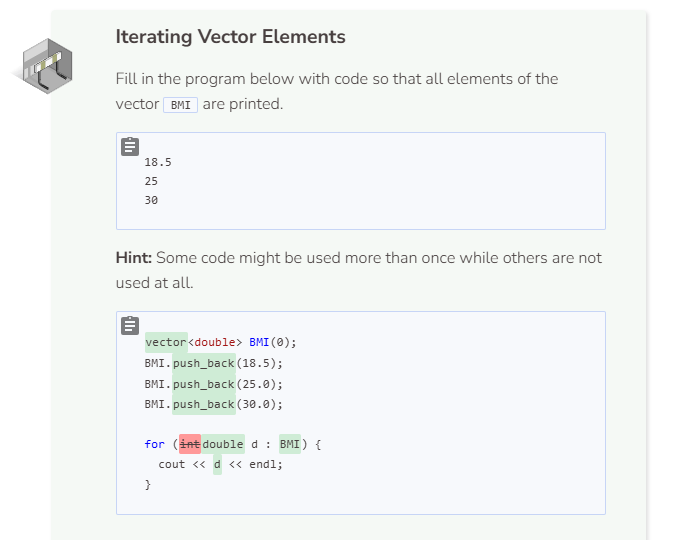
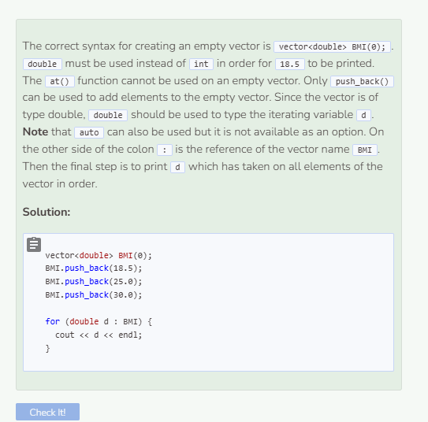

# Iterating a Vector
## Iterating Vector Elements
Iterating through a vector is very similar to iterating through an array. The main difference is that in a vector, we use `at()` to access the elements instead of brackets `[]`. Both of the code blocks below use a regular for to produce the exact same results. The first code block contains an array and the second contains a vector.

```cpp
//iterating through an array
int grades[] = {85, 95, 48, 100, 92};

for (int i = 0; i < sizeof(grades)/sizeof(grades[0]); i++) {
  cout << grades[i] << endl;
}
```

```cpp
//iterating through an vector
vector<int> grades{85, 95, 48, 100, 92};

for (int i = 0; i < grades.size(); i++) {
  cout << grades.at(i) << endl;
}
```

## Enhanced For Loop in Vector
We can also use an enhanced for loop, or range-based for loop, to iterate through a vector.

```cpp
//iterating a vector with Enhanced For Loop
vector<int> grades{85, 95, 48, 100, 92};

for (auto i : grades) { //can use int or auto for iterating variable!
  cout << i << endl;
}
```

When using an enhanced for loop for a vector, you must label the iterating variable accordingly. If your elements are of type int then your iterating variable must also be int. If the elements are strings then your variable must be typed as string. However, you can always use auto to force the variable to match your element type.


