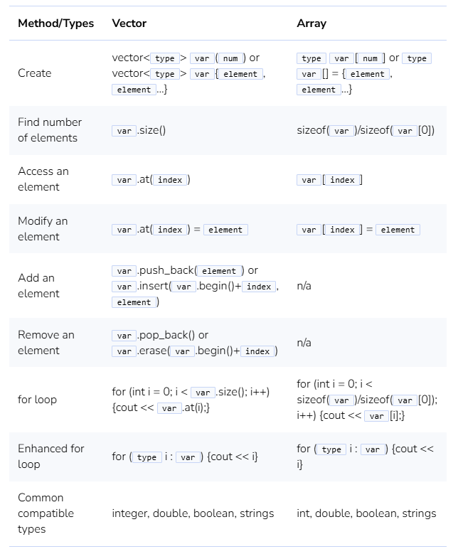
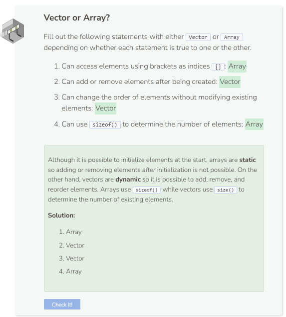

# Vector vs. Array
## Vector vs. Array
Which one is better: vector or array? The answer is, it really depends. If you know how many elements you need in your collection and you don’t intend on changing the order of those elements, then it is better to use an array. On the other hand, if you don’t know how many elements you need and want to modify the order of elements later on, then it is better to use a vector.

Although an array is shorter to write and arguably easier to use, it is static, meaning it is not possible to add additional elements to the array after it has already been initialized. In contrast, a vector is more dyanamic, meaning you can add, remove, and reorganize elements as needed later on.

Here is a table showing the differences between vectors and arrays. Note that type stands for data type. Also note that var stands for vector or array name, num stands for an integer number, index stands for index or position number, and element stands for a vector or array element.



## Using Both a Vector and Array
Vectors and arrays can be used in tandem with each other. For example, the following code keeps track of the top five students in a class.

```cpp
string top[] = {"First: ", "Second: ", "Third: ", "Fourth: ", "Fifth: "};
vector<string> names(0);

names.push_back("Alan");
names.push_back("Bob");
names.push_back("Carol");
names.push_back("David");
names.push_back("Ellen");

for (int i = 0; i < 5; i++) {
  cout << top[i] << names.at(i) << endl;
}
```

