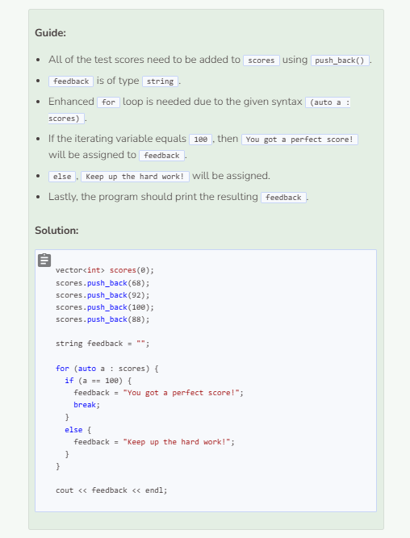

# Helpful Vector Algorithms
## Vector Algorithms
Like arrays, vectors can be used to search for a particular element and to find a minimum or maximum element. Additionally, vectors can reverse the order of elements rather than just simply printing the elements in reverse order.

### Searching for a Particular Element
```cpp
vector<string> cars(0);
string Camry = "A Camry is not available."; //default string value

cars.push_back("Corolla");
cars.push_back("Camry");
cars.push_back("Prius");
cars.push_back("RAV4");
cars.push_back("Highlander");

for (auto a : cars) { //enhanced for loop
  if (a == "Camry") { //if "Camry" is in vector
    Camry = "A Camry is available."; //variable changes if "Camry" exists
  }
}
    
cout << Camry << endl; //print whether Camry exists or not
```

### Finding a Minimum or Maximum Value
```cpp
vector<int> grades(0);
grades.push_back(72);
grades.push_back(84);
grades.push_back(63);
grades.push_back(55);
grades.push_back(98);

int min = grades.at(0); //set min to the first element in the array

for (auto a : grades) { //enhanced for loop
  if (a < min) { //if element is less than min
    min = a; //set min to element that is less
  }
}
//elements are not modified so enhanced for loop can be used

cout << "The lowest grade is " << min << endl; //print lowest element
```

```cpp
vector<int> grades(0);
grades.push_back(72);
grades.push_back(84);
grades.push_back(63);
grades.push_back(55);
grades.push_back(98);
  
int max = grades.at(0);

for (auto a : grades) {
  if (a > max) {
    max = a;
  }
}

cout << "The highest grade is " << max << endl;
```

### Reversing the Order of Elements
```cpp
vector<string> letters(0);
letters.push_back("A");
letters.push_back("B");
letters.push_back("C");
letters.push_back("D");
letters.push_back("E");
    
int original = letters.size(); //original size
    
//regular for loops needed to access element indices

for (int i = letters.size() - 1; i >= 0; i--) {
  letters.push_back(letters.at(i));
} //add elements in reverse order to the vector
    
for (int j = 0; j < original; j++) {
  letters.erase(letters.begin());
} //remove all the original elements

//enhanced for loop can be used for just printing
for (auto a : letters) {
  cout << a << " "; //print all new vector elements
}
```

Note that we used `letters.erase(letters.begin())` which causes the system to delete both the element and the index. Thus, the next element in the vector becomes the new 0th index which we want to continue to delete.



