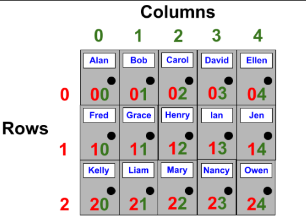
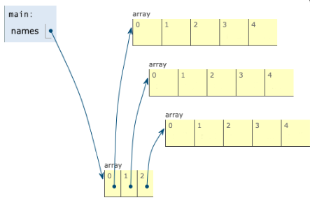
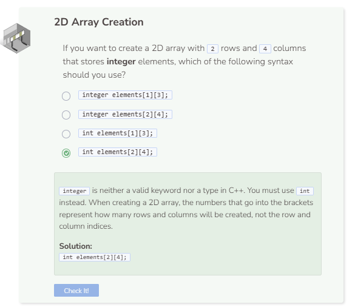

# Creating a 2D Array
## An Array Inside Another Array
An array inside another array is called a 2D array. A 2D arrays is symbolic of a table where there are rows and columns. The first index number represents the row position and the second index number represents the column position. Together, the row and column indices enable elements to be stored at specific locations.



```cpp
string names[3][5];
```

### 2D Array Syntax
- Array type followed by a name for the 2D array followed by two empty pairs of brackets `[][]`.
- The number of rows goes inside the first pair of brackets and the number of columns goes inside the second pair of brackets.

## Why Array Inside Array?
The way 2D arrays store elements is a little unique. Rather than creating an actual table like shown above, each initial row of the 2D array actually refers to another column array. This is why a 2D array is considered to be an array inside of another array.



To determine the number of rows and columns in the 2D array, we can use the `sizeof()` operator like we did for arrays.

```cpp
string names[3][5];

cout << sizeof(names) / sizeof(names[0]) << " rows" << endl;
cout << sizeof(names[0]) / sizeof(string) << " columns" << endl;
```

Note that when determining column length, you must refer to the 2D array’s 0th row index. For example, `names[0]` doesn’t just refer to the first element in the row, it also refers to the entire column of elements. See image above.

`sizeof(names[0])` calculates the size of the entire row while `sizeof(string)` calculates the size of one string. Thus, dividing the two, `sizeof(names[0]) / sizeof(string)`, will calculate how many string elements there are.

