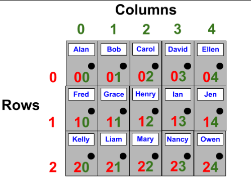
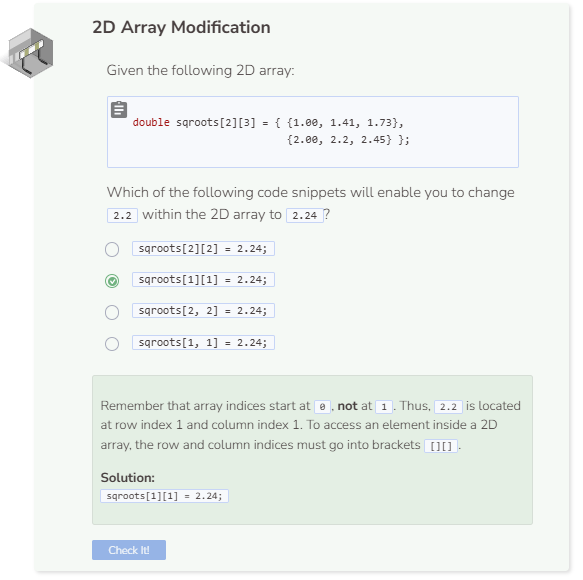

# Accessing and Modifying a 2D Array
## 2D Array Access
To access and modify elements inside a 2D array, you need to specify the row and column indices at which the elements are located. For example `names[1][2]` refers to the element that’s at row index 1 and column index 2.



Below is a code block showcasing a 2D array that contains fifteen P.O. Box names from a postal office. Note that you can initialize the elements inside your 2D array just like how you initialize elements inside a regular array. Each column array is separated by curly braces `{}` as well as a comma `,`.

```cpp
string names[ ][5] = { {"Alan", "Bob", "Carol", "David", "Ellen"},
                       {"Fred", "Grace", "Henry", "Ian", "Jen"},
                       {"Kelly", "Liam", "Mary", "Nancy", "Owen"} };
    
cout << names[1][2] << endl;
```

Note that you must declare the number of elements within the column brackets. You can leave the row brackets empty, but you cannot leave the column brackets empty. Also, when you try to print an element that is outside of the row/column range, the system will either print random memory data or nothing at all.

## 2D Array Modification
To modify elements within a 2D array, simply access the element and assign another element to it.

```cpp
string names[3][5] = { {"Alan", "Bob", "Carol", "David", "Ellen"},
                       {"Fred", "Grace", "Henry", "Ian", "Jen"},
                       {"Kelly", "Liam", "Mary", "Nancy", "Owen"} };
    
cout << names[1][2] << endl;

names[1][2] = "Harry";
cout << names[1][2] << endl;
```

