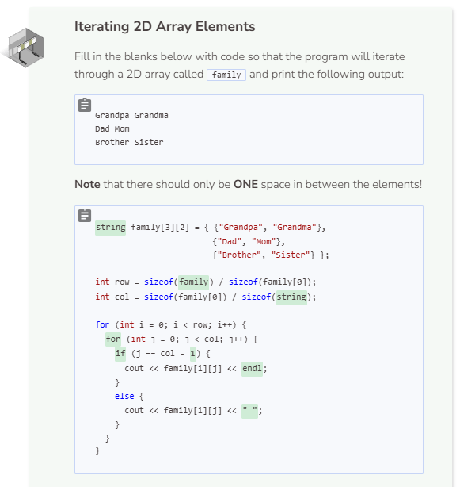

# Iterating a 2D Array
## 2D Array Iteration
To iterate through a 2D array, we can use two for loops, one nested inside another. The outer for loop is for the rows while the inner for is for the columns.

```cpp
int digits[3][3] = { {1, 2, 3},
                     {4, 5, 6}, 
                     {7, 8, 9} };

int row = sizeof(digits) / sizeof(digits[0]); //number of rows
int col = sizeof(digits[0]) / sizeof(int); // number of columns

for (int i = 0; i < row; i++) {
  for (int j = 0; j < col; j++) {
    cout << digits[i][j] << endl;
  }
}
```

Note that all of the columns’ lengths are the same, there are 3 columns for each row. Therefore, it doesn’t matter if we use `digits[0]`, `digits[1]`, or `digits[2]` when calculating the number of elements in each row and column. Also note that using `<< endl` prints the elements vertically while removing it prints the elements horizontally. To print the elements so that the columns stay together but the rows separate, we can try something like this:

```cpp
int digits[3][3] = { {1, 2, 3},
                     {4, 5, 6}, 
                     {7, 8, 9} };

int row = sizeof(digits) / sizeof(digits[0]);
int col = sizeof(digits[0]) / sizeof(int);

for (int i = 0; i < row; i++) {
  for (int j = 0; j < col; j++) {
    if (j == col - 1) {
      cout << digits[i][j] << endl;
    }
    else {
      cout << digits[i][j] << " ";
    }
  }
}
```

The `if` conditional forces the elements to be printed with a newline every time the iterating variable reaches the end of the column index. Otherwise, the elements will be printed with a space instead.

## 2D Array with Enhanced For Loop
Like arrays and vectors, 2D arrays can also make use of the enhanced `for` loop.

```cpp
int digits[3][3] = { {1, 2, 3},
                     {4, 5, 6}, 
                     {7, 8, 9} };

for (auto &i : digits) {
  for (int j : i) {
    if ((j == 3) | (j == 6) | (j == 9)) {
      cout << j << endl;
    }
    else {
      cout << j << " ";
    }
  }
}
```

You may have noticed that the outer loop contains `for (auto &i : digits)`. Unlike a regular array where we can access the first element by locating just one index, we need two indices in order to access elements within a 2D array. The `&i` creates a reference iterating variable that can refer to the 2D array. We type it as `auto` because doing so will cause the system to force the variable to match the 2D array type. In fact, we can always use auto to type variables to cause them to match the data that they refer to. For example, we can use for (auto j : i) for the inner loop instead of using int.

Also note that we cannot use an enhanced for loop to manipulate array indices. Our iterating variable goes through the 2D array and takes on each element value rather than each element index. This is why we have the conditional statement `if ((j == 3) | (j == 6) | (j == 9))` rather than `if (j == col - 1)`.



