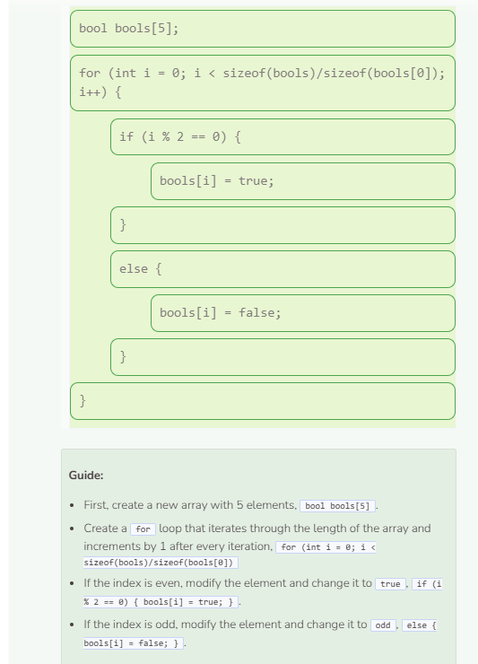

# Lab: Arrays
## Tutorial Lab 1: Using an Array
An array is a data structure that groups data together into a collection of elements. Each element has its own index or position within the array. These elements can be initialized, accessed, modified, and printed.

```cpp
string classes[] = {"Math", "English", "Science", "Social Studies", "Spanish"};

classes[4] = "French";

for (int i = 0; i < sizeof(classes)/sizeof(classes[0]); i++) {
  cout << classes[i] << endl;
}
```

### Program Summary
- An array called classes is created and initialized with elements (i.e. "Math", "English", etc.).
- At index 4, "Spanish" is modified and replaced with "French". Keep in mind that array indices start at 0, not 1.
- A for loop iterates through the elements in the array. It starts at index 0, ends right before index 5, and increments by 1 after each iteration.
- Each element from index 0 through index 4 gets printed with a newline.



