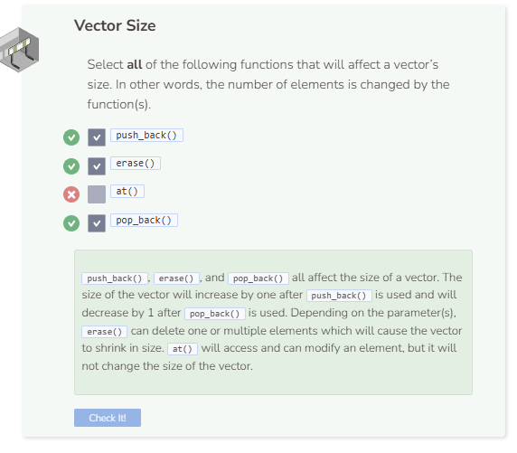

# Lab: Vectors
## Tutorial Lab 2: Using a Vector
A vector is another data structure that has many of the same functionalities as an array. However, they are more flexible in the functions that they are able to use. These functions include adding and removing elements within the vector, meaning vectors can dynamically change their size, something arrays cannot do.

```cpp
vector<string> veggies(0);
veggies.push_back("carrot");
veggies.push_back("tomato");
veggies.push_back("celery");
veggies.push_back("spinach");

veggies.erase(veggies.begin()+1);
veggies.at(1) = "potato";

for (auto a : veggies) {
  cout << a << endl;
}
```

### Program Summary
- A vector called `veggies` is created.
- `carrot`, `tomato`, `celery`, and `spinach` are added to the vector as elements.
- The element at index 1 (`tomato`) is removed.
- The element `potato` replaces the element at index 1, which is currently `celery` since `tomato` was deleted previously.
- An enhanced `for` loop is used which creates an iterating variable a (typed auto) to take on the value of each element.
- Each element `a` is then printed with a newline.


