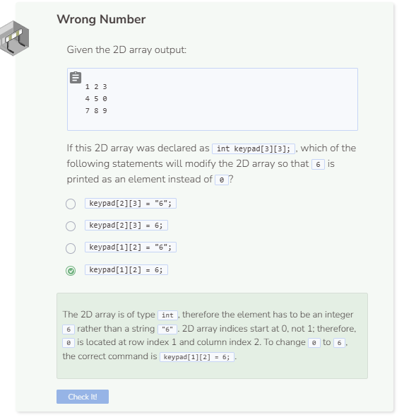

# Lab: 2D Arrays
## Tutorial Lab 3: Using a 2D Array
A 2D array is an array inside another array. This data structure can be visually compared to a table where there are rows and columns and each element exists inside each “cell.” To access or modify elements, both the row index and column index are needed. Like arrays, 2D arrays are static so elements cannot be added or removed after initialization.

```cpp
int coordinates[5][2] = { {-4, 3},
                          {2, 1},
                          {0, -8},
                          {-11, 9},
                          {-5, -7} };

int row = sizeof(coordinates) / sizeof(coordinates[0]);
int col = sizeof(coordinates[0]) / sizeof(int);
                        
for (int i = 0; i < row; i++) {
  for (int j = 0; j < col; j++) {
    if (j == 1) {
      cout << coordinates[i][j] << endl;
    }
    else {
      cout << coordinates[i][j] << " ";
    }
  }
}
```

