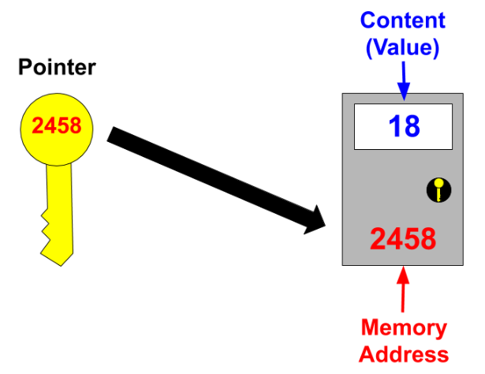
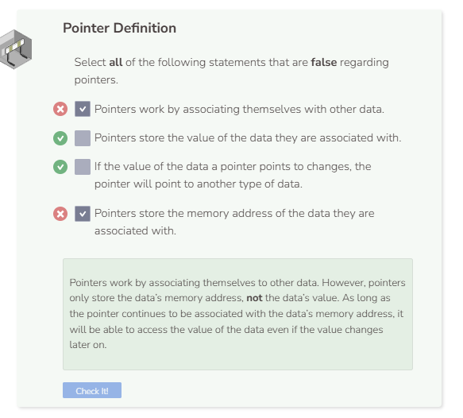

# What Is a Pointer?
## Pointer Introduction
A pointer is a data type that stores a memory address of another piece of data. Much like how an array points to all of its elements as a collection, pointers point to the memory address of the data that they are associated with.

The picture above shows how pointers work. A pointer is like a key that stores the address of the locker that it is associated with. This association also enables the pointer to gain access to the content of what’s inside the locker.

The advantage of using a pointer is that you do not need to worry about the value of the data that the pointer is pointing to. Thus, if the data ever changes its value, the pointer will still be able to access the new data as long as the pointer still points to the data’s memory address.

