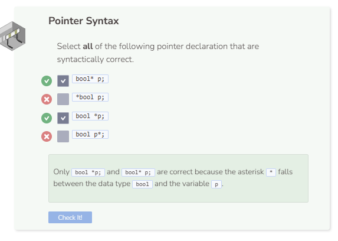

# Declaring a Pointer
## Pointer Declaration
All pointers have a data type and a name that they are referred to. To declare a pointer, you need to have the following syntax in order:
- The data type of the pointer (e.g. int, string, etc.).
- An asterisk symbol `*`.
- A name for the pointer.

```cpp

int* p;

cout << p << endl;
```
- The asterisk symbol can be placed anywhere between the end of the data type (i.e. `int`) and the variable name (i.e. p). `int* p`;, `int *p`, and `int * p` all work the same way.
- Pointers can only be assigned a memory address, which is why trying to assign `2` to a pointer will result in an error.
- Pointers that are not assigned a memory address will have a default output of `0`, also referred to as `null` pointers.

