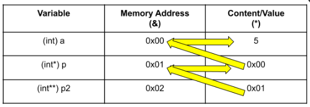
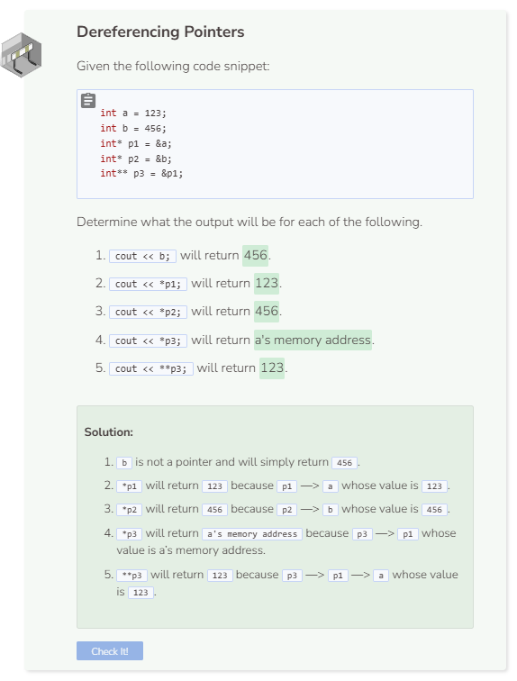

# Dereference Operator
## Pointer Dereference
Every memory address holds a value and that value can be accessed by using the dereference operator. The dereference operator is denoted by the asterisk symbol `*`.

```cpp
int a = 5; //regular int variable set to 5
int* p = &a; //int pointer points to a's memory address

cout << *p << endl; //dereference p to print its content
```
- A pointer can only be assigned a memory address of a variable that holds a value of the same type as the pointer. For example, if `&a` is the memory address of an `int` variable, then you cannot assign it to a string pointer (`string* p = &a`).
- Though memory address is dynamic, once a pointer has been assigned a memory address, that association remains until the program is re-compiled or re-executed.

## Pointer to another Pointer
It is possible to have a pointer point to another pointer. To assign the memory address of a pointer to a new pointer, that new pointer must be denoted with two asterisk symbols `**`.

```cpp
int a = 5;
int* p = &a;
int** p2 = &p;

cout << *p << endl;
cout << **p2 << endl;
```

Dereferencing a new pointer to an old pointer will return the memory address of the old pointer. If that pointer is dereferenced again, then the value of the variable that the old pointer pointed to will be returned. For example, `**p2` and `*p `both returned `5` because `p2` points to `p` which points to `a` which equals `5`.



If you dereference an array, it will return only the first element in the array.
```cpp
int array[] = {24, 52, 97};

cout << *array << endl;
```

