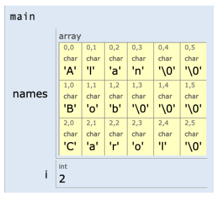
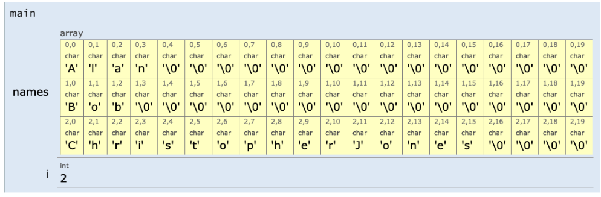
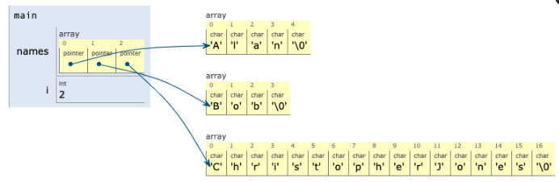
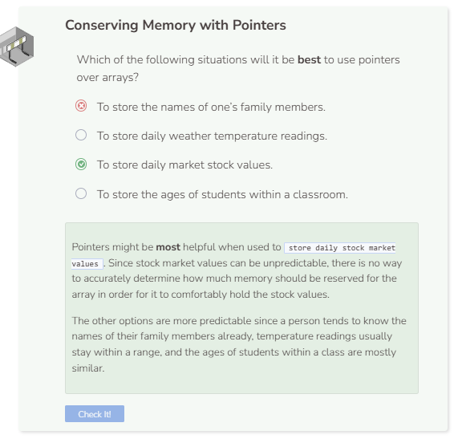

# Why Use Pointers?
## Array Memory Usage
Before we can see how useful pointers can be, let’s take a look at how memory is used within an array:

```cpp
char names[3][6] = { "Alan", 
                     "Bob", 
                     "Carol" };
                     
for (int i = 0; i < sizeof(names) / sizeof(names[0]); i++) {
  cout << names[i] << endl;
}
```
The row index `[3]` is optional but the column index `[6]` is mandatory.

**Why is the column index 6 instead of 5?**

When working with a string of characters, the last character is always a special character known as a null character. This character is often referred as `NUL` or `\0`. Therefore, the maximum character length within this array is `'C','a','r','o','l','\0'`, which has 6 characters. This is why to be able to store all of the characters, the column index must be set to `6`.

The code above creates an array of characters where the row index `[3]` refers to the three starting characters `A` for `Alan`, `B` for `Bob`, and `C` for `Carol`, and the column index `6` refers to how many character each of the rows can hold which also includes the null characters (`NUL` or `\0`). Notice how the null characters also take up memory space.



Here, we know how long the names would be, so we were able to budget the right amount memory for them. However, what if we didn’t? In such a case, we would have to assign additional space for our characters, something larger, like `20` for example. That way, if the name `Carol` was a mistake and it was actually supposed to be `ChristopherJones`, we can feel more confident that the array will still be able to hold all of the characters. Unfortunately, this causes more memory to be wasted as depicted in the image below.



## Pointer Usage
This is where pointers come in handy because they can help the system save memory. When using pointers for character arrays, the pointers will only point to the 3 leading characters `A`, `B`, and `C`. You do not need to specify the column index. Note that C++ requires the keyword `const` for pointers that point to characters within an array. This forces the characters to remain intact and prevents the pointer from potentially pointing elsewhere.

```cpp
const char* names[] = { "Alan", 
                         "Bob", 
                         "ChristopherJones" };
                     
for (int i = 0; i < sizeof(names) / sizeof(names[0]); i++) {
  cout << names[i] << endl;
}
```



Notice how we did not have to include any index values, which means the potential for wasting memory can be avoided. All we needed was to reserve enough memory for the creation of 3 pointers.

