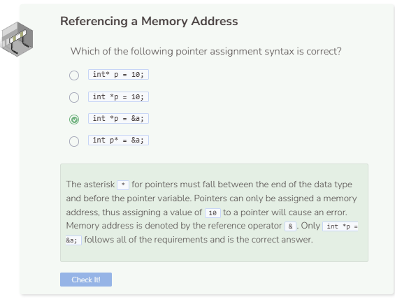

# Reference Operator
## Pointer Reference
A pointer can only be assigned a **memory address**. They cannot be assigned values that are `int`, `double`, `string`, etc. A memory address is denoted with the `&` symbol, called the **reference** operator, and they go in front of the variable that the address is associated with.

```cpp
int a = 2;
int* p = &a;

cout << p << endl;
```

- Memory is dynamic in C++ so whenever programs are compiled or executed again, they will often output memory addresses that are different from before.
- Though memory address is dynamic, once a pointer has been assigned a memory address, that association remains until the program is re-compiled or re-executed.

