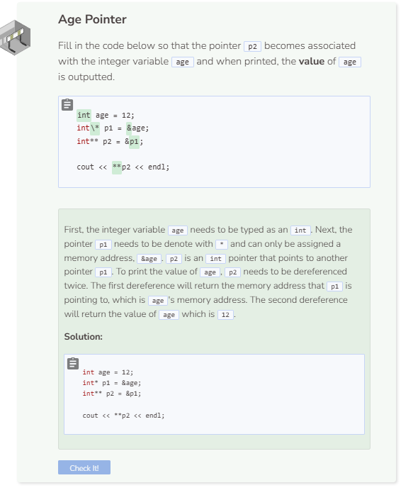

# Lab: Pointer Operators
## Tutorial Lab: Reference and Dereference Operators
Pointers are used to store the memory address of a particular variable. Two important operators associated with pointers are the reference `&` and the dereference operators `*`. The `&` operator returns the memory address of a variable and the `*` operator returns the value or content of the variable being pointed to.

```cpp
bool b = true;
bool* p = &b;

cout << p << endl; //prints b's memory address
cout << boolalpha << *p << endl; //prints b's value
```

A pointer can also point to **another pointer**. When doing so, the new pointer will be denoted with two asterisk symbols `**`. `**` is also used to dereference a pointer twice.

```cpp
bool b = true;
bool* p = &b;
bool** p2 = &p; //p2 points to p

cout << p2 << endl; //prints p's memory address
cout << *p2 << endl; //prints p's content which is b's address
cout << boolalpha << **p2 << endl;
//p2 is dereferenced twice to print b's value
```

