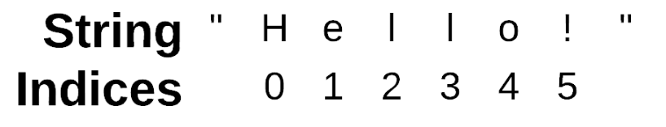
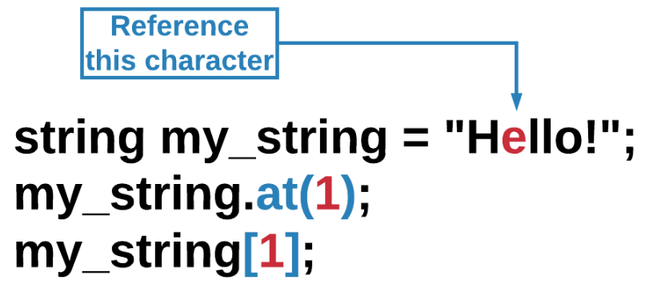
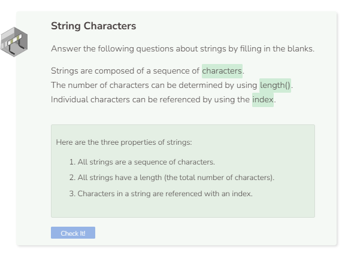

# String Properties
## String Length
We have already seen strings in the "Fundamentals"section. We are going to dig a little deeper with this data type. All strings have the following characteristics:
1. **Characters** - Strings are made up of characters between quotation marks (previously covered in the “Fundamentals” section).
2. **Length** - Each string has a length (total number of characters).
3. **Index** - Each character in a string has a position, called an index.
To calculate the length of a string, use the `length()` function. This function will return an integer that is the sum of all of the characters between the quotation marks.  

```cpp
string my_string = "Hello";
int len_string = my_string.length();

cout << len_string << endl;
```

Although each character that you see on a typical keyword usually has a length of `1`, there are other foreign characters that do not follow this convention. For example, `Привет`, which stands for `Hello` in Russian, actually has a length of 12 instead of 6.

## String Index
Previously in the vectors module, we learned that vectors and arrays have elements that reside in certain positions or indices. A string too has indices that correspond to the position where each of its character resides. Like vector and array indices, string indices also start at 0.



**Strings & Quotation Marks**: Quotation marks are required to declare the value of a string. However, quotation marks are not a part of the string itself. That is why quotation marks are not counted with the `length()` function and why they do not have an index.

To reference a character, use the string name followed by the `at()` function. Within parentheses `()`, provide the index number of the character you want the system to return. Alternatively, you can also use brackets `[]` to enclose the index number.



```cpp
string my_string = "Hello!";
char character = my_string.at(1);

cout << character << endl;
```

Note that you cannot use `my_string[my_string.length()]`. An index number is needed.

