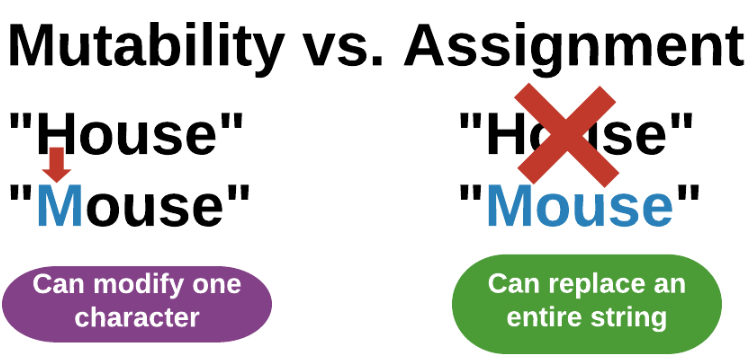
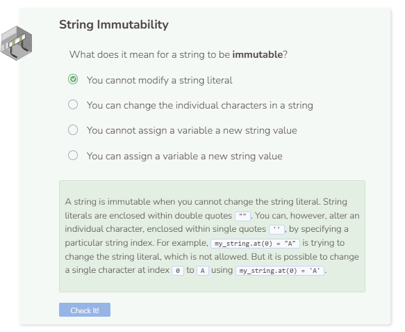

# Mutability
## Mutability
You now know how to reference each character of a string. What do you think the code below will do?

```cpp
string my_string = "House";
my_string.at(0) = "M";

cout << my_string << endl;
```

If you thought the code above would print Mouse, that would be a logical guess. However, you see an error. Unlike vectors and arrays where the characters can be manipulated, string literals are immutable. That means you cannot change the string literal itself. You can, however, manipulate a particular character within the string.

```cpp
string my_string = "House";
my_string.at(0) = 'M';

cout << my_string << endl;
```

Can you spot the difference between the two code snippets mentioned above? The difference lies within the double quotes `""` and single quotes `''`. You cannot change the string literal, but you can change a character at a particular index. Thus, `my_string.at(0) = 'M'` changes the string to Mouse but `my_string.at(0) = "M"` does not.

## String Re-Assignment
In addition to character manipulation, you can also change the entire string itself by overwriting it with a new value(s).

```cpp
string my_string = "House";
my_string = "Mouse";

cout << my_string << endl;
```

Strings in C++, like other data types, can be re-assigned. The previous examples on this page are about mutability. That is, changing just a part of a whole. The current example is about the assignment operator. Re-assignment replaces the entire value of a variable with a new value. In conclusion, you can either change one character at a time within a string, or change the entire string literal by reassigning it.



A string is immutable when you cannot change the string literal. String literals are enclosed within double quotes `""`. You can, however, alter an individual character, enclosed within single quotes `''`, by specifying a particular string index. For example,` my_string.at(0) = "A"` is trying to change the string literal, which is not allowed. But it is possible to change a single character at index `0` to `A` using `my_string.at(0) = 'A'`.

