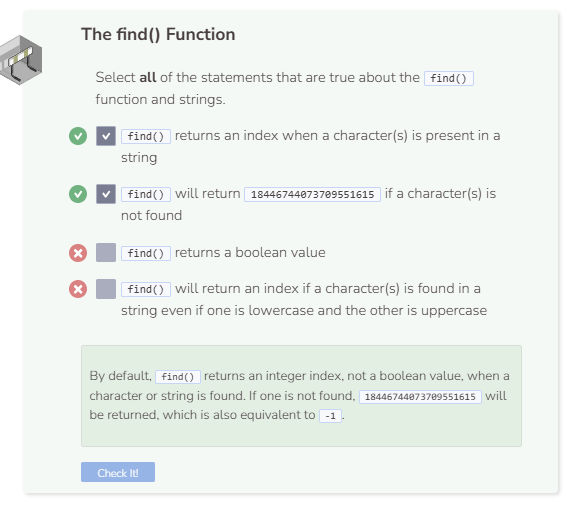

# Find
## The find() Function
The `find()` function tells you if a character or a string is present in another string, and if so, at what index it is at. `find()` returns an integer index if the character or string is present and `18446744073709551615` if not.

**What does `18446744073709551615` mean?**: `18446744073709551615` is the largest integer value possible in C++. When `find()` is called and `18446744073709551615` is returned, it means the system has searched through all values and cannot locate the specified value. `18446744073709551615` is an unsigned value, but it is equivalent to `-1` as a signed value.

```cpp
string my_string = "The brown dog jumps over the lazy fox.";

cout << my_string.find("dog") << endl;
```

If you want to start searching for a string or character starting at a particular index, you can specify the start index number after the specified string.

```cpp
string my_string = "The brown dog jumps over the lazy fox.";

cout << my_string.find("he", 4) << endl; //start at index 4
```



