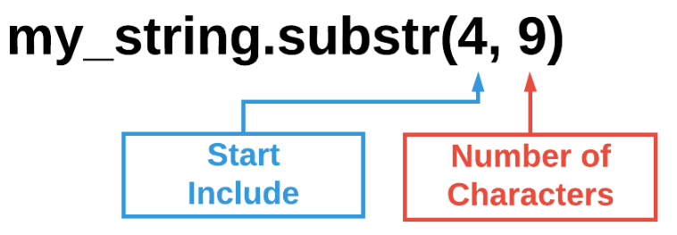
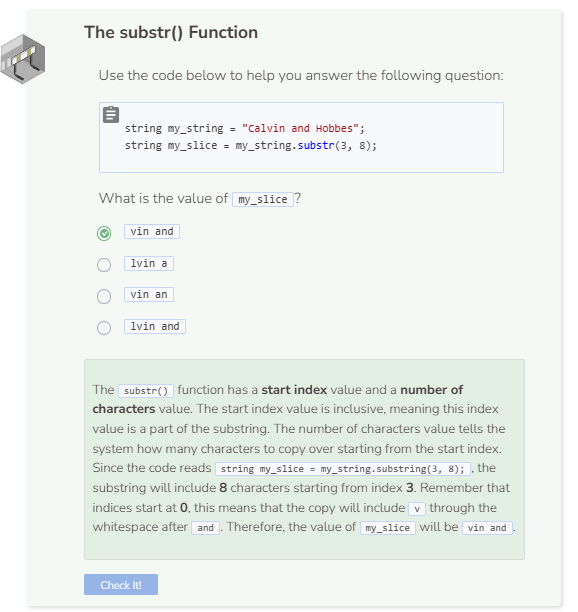

# Substr
## The substr() Function
The `substr()` function returns a portion of the string. Within parentheses `()`, provide the index at which you want the string to start followed by a comma followed by the number of characters you want the string to include. Note that if you don’t specify the number of characters, the system will start copying from the start index through to the end of the string. If you don’t specify the start index, then the system will copy the entire string. The `substr()` function does not modify the original string. Instead, it returns a partial or entire copy of the original string.



```cpp
string my_string = "The brown dog jumps over the lazy fox.";
string my_slice = my_string.substr(4, 9);

cout << my_slice << endl;
```


