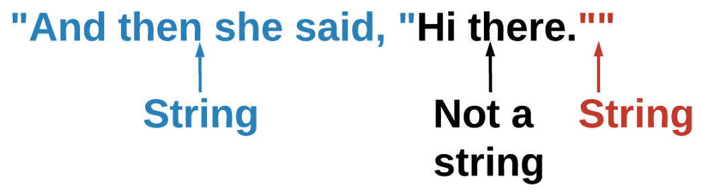

# Escape Characters
## Escape Characters
An escape character is a character that has a different interpretation than what you see in a string. Escape characters always start with a backslash (`\`). The most common escape character is the newline character (`\n`) which causes C++ to print on the next line.

```cpp
string my_string = "Hello\nworld";
cout << my_string << endl;
```

|Escape| Character|	Description	Example|
|-|-|-|
|\ |	Prints a backslash|	cout << "\\" << endl;|
|\’|	Prints a single quote|	cout << "\'" << endl;|
|\"|	Prints a double quote|	cout << "\"" << endl;|
|\t|	Prints a tab (spacing)|	cout << "Hello\tworld" << endl;|

## Quotes Inside Quotes
Imagine that you have this small bit of dialog, `And then she said, "Hi there."` and want to store it as a string. Typing `"And then she said, "Hi there.""` would cause an error.



When you use a `"` to start a string, C++ looks for the next `"` to end it. To avoid syntax errors, you can use a double quote to start your string, single quotes for the inner quote, and end the string with a double quote.

```cpp
string my_string = "And then she said, 'Hi there.'";
cout << my_string << endl;
```

