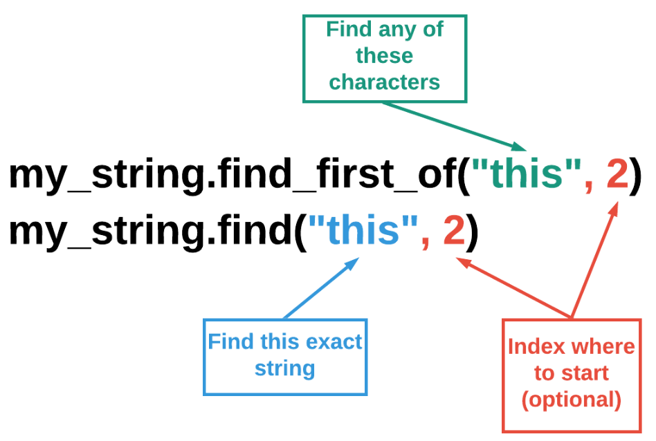
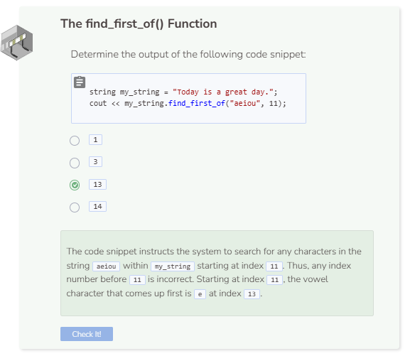

# Find First Of & Last Of
## The find_first_of() Function
The `find_first_of()` function works similarly to how the `find()` function does. However, the `find_first_of()` function will search for any matching characters specified. For example, given the string `"this is his string"`, `my_string.find_first_of("his")` will return `1` because the character `h` within his appears first at index number `1`. Like the `find()` function, you can optionally specify an index number to direct the system where to start searching.



**The find_last_of() function**: You can use the `find_last_of()` function to search for a set of characters in a string that occur last. Here is an example, given the string `"this is his string"`, `my_string.find_last_of("his")` will return `15` because the `i` in `his` occurs last at index 15. If you don't want the system to search the whole string, you can specify an index as a second parameter to direct the system where to start searching.

```cpp
string string1 = "The brown dog jumps over the lazy fox.";
string string2 = "brown";

cout << string1.find_first_of(string2) << endl;
```

Remember that `18446744073709551615` is equivalent to `-1` which also means `not found`.

