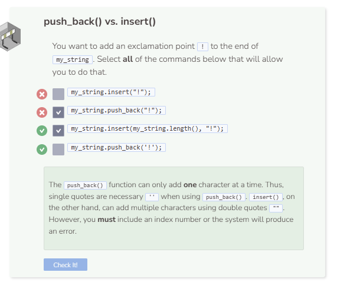

# Push Back & Insert
## The push_back() Function
In a previous module, you were introduced to vectors. The `push_back()` function works the same way in strings as it does in vectors. It adds a specific character to the end of the string.

```cpp
string my_string = "Today is Satur";
my_string.push_back('d');

cout << my_string << endl;
```

## The insert() Function
Unfortunately, the `push_back()` function cannot add multiple characters (string) to an existing string. However, the `insert()` function can. Unlike many functions where specifying the starting index number is optional, doing so is necessary for `insert()` to work.

Note that the index specification comes before the string you want the system to add. For example, `my_string.insert(0, "abc")` will add the string abc to the 0th index which is also the beginning of the string. To add to the end of the string, you can use `my_string.length()`. Note that you do not need to subtract 1 from my_string.length() because the system will add characters starting at the index **after** the last character of the string.

The push_back() function can only add one character at a time. Thus, single quotes are necessary `''` when using `push_back()`. `insert()`, on the other hand, can add multiple characters using double quotes `""`. However, you must include an index number or the system will produce an error.


