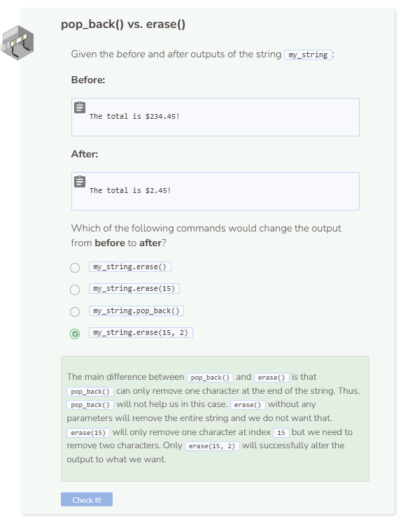

# Pop Back & Erase
## The pop_back() Function
The `pop_back()` function removes a single character from the end of a string. You do not include anything within parentheses `()`.

```cpp
string my_string = "Today is my birthday!";
my_string.pop_back();

cout << my_string << endl;
```

## The erase() Function
The `erase()` function can remove multiple characters from a string or the entire string itself. To remove the whole string, leave the parentheses `()` empty. Alternatively, you can specify one index number to remove all characters starting at that index to the end of the string. Specify two index numbers to start at an index and erase a certain number of characters at that index forward.

```cpp
string my_string = "Today is my birthday!";
my_string.erase(my_string.length()-1);

cout << my_string << endl;
```

**Why do I see `Command was successfully executed.`?**: When Codio does not detect anything being printed to the console, you will see the message Command was successfully executed. displayed. The command `my_string.erase()` causes the entire string to become empty and since an empty string has no output, you will see `Command was successfully executed.` instead.


