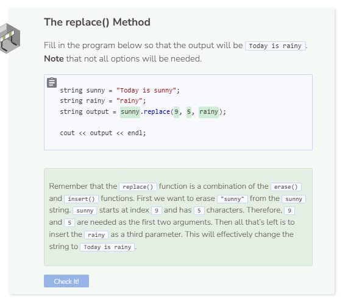

# Replace
## The replace() Function
The `replace()` function is really a combination of the `erase()` and `insert()` functions. Let’s take a look at an example.

`my_string.replace(1, 2, "3")`

There are three parameters of interest within `replace()` above. The `1` represents the index at which we want to start erasing. The `2` tells the system how many characters to erase starting at index `1`. And the `"3"` is the string that the system will insert into the string at index `1`.

```cpp
string string1 = "Hello world!";
string string2 = "Codio.";
string string3 = string1.replace(6, 5, string2);
// erase all characters from index 6 plus 5 chars to the right in string1
// then insert string2 at index 6 within string1

cout << string3 << endl;
```

