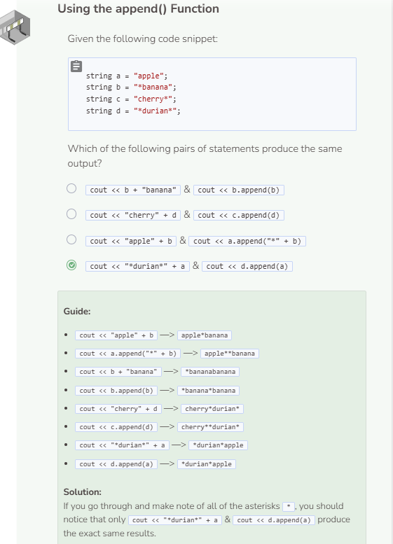

# Append
## The append() function
An alternative way to concatenate or combine strings is to use the `append()` function. The `append()` function works in the same way as adding literal strings together using the `+` operator.

**NOTE** that the `append()` function is exclusively for strings. Thus, you cannot include other data types like ints when using append() unless they are converted to strings first. Additionally, when using the + operator to combine two strings together, make sure that at least one of the strings is a string variable. Otherwise, the system will think you are trying to manipulate a string literal, which is not allowed.

