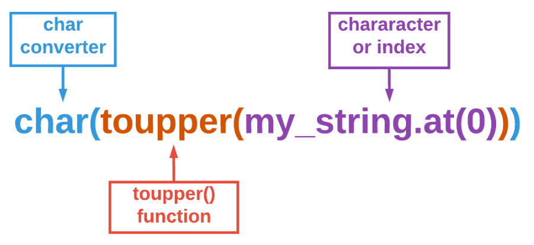
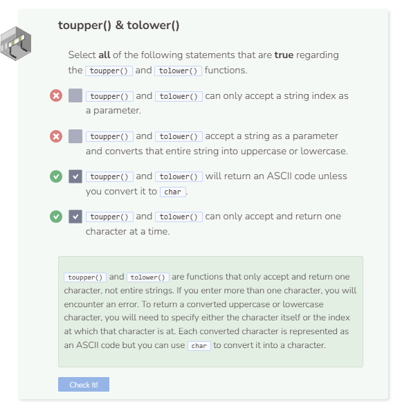

# Uppercase & Lowercase
## The toupper() Function
The `toupper()` function returns the uppercase form of a specified character. Insert the character you wish to convert as a parameter.

Note that by default, `toupper()` returns the ASCII representation of the uppercase letter. Thus, you’ll need char to convert the ASCII code into alphabetical.



```cpp
string my_string = "the big brown dog";

cout << char(toupper(my_string.at(0))) << endl;
```

## The tolower() Function
The `tolower()` function returns the lowercase form of a specified character. It has all of the technicalities that the `toupper()` function has.

```cpp
string my_string = "THE BIG BROWN DOG";

cout << char(tolower(my_string.at(1))) << endl;
```

