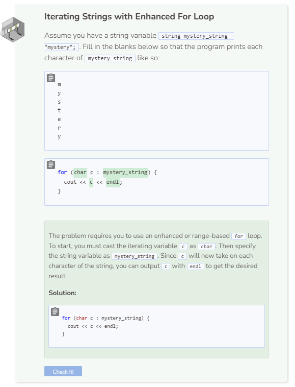

# Iteration: For Loop
## Iterating Over Strings
Iterating over a string allows you to deal with each character of a string individually without having to repeat certain commands. You start with the character at index 0 and move through the end of the string.

```cpp
string my_string = "Hello world";

for (int i = 0; i < my_string.length(); i++) {
  cout << my_string.at(i);
}
```

Note that you can also use a range-based or enhanced `for` loop to iterate over strings. Make sure to cast the iterating variable as `char`!

```cpp
string my_string = "Hello world";

for (char c : my_string) {
  cout << c;
}
```

