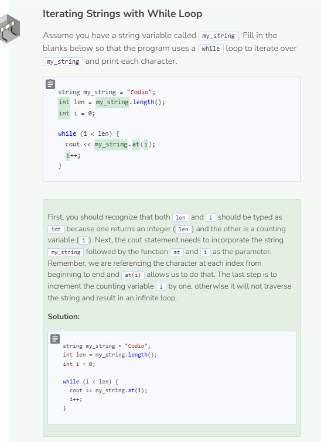

# Iteration: While Loop
## While Loop
String iteration is most often done with a `for` loop. However, a `while` can be used as well.

```cpp
string my_string = "Calvin and Hobbes";
int i = 0;

while (i < my_string.length()) {
  cout << my_string.at(i);
  i++;
}
```

## Comparing While & For Loops
```cpp
string my_string = "C++";

for (int i = 0; i < my_string.length(); i++) {
  cout << my_string.at(i);
}
```

```cpp
string my_string = "C++";
int i = 0;

while (i < my_string.length()) {
  cout << my_string.at(i);
  i++;
}
```

Above are two ways of iterating through a string. The first way uses the `for` loop and the second uses a `while` loop. Both produces the same result. However, the for loop is usually preferred because it requires less code to accomplish the same task. You can also use an enhanced `for` loop, which requires the least account of code, but an enhanced `while` loop does not exist.


