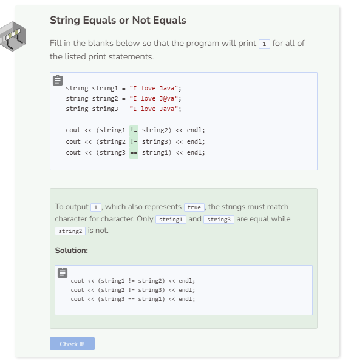

# == & !=
## Comparing with ==
The `==` operator can be used with strings just like it is with numbers or boolean values. Note that without the boolalpha flag, the system will return `1` if `true` and `0` if `false`. `1` represents string equality and `0` represents inequality.

```cpp
string string1 = "It's Friday!";
string string2 = "It's Friday!";

cout << (string1 == string2);
```

## Comparing with !=
You can also test for string inequality with the `!=` operator.

```cpp
string string1 = "It's Friday!";
string string2 = "It's Monday.";

cout << (string1 != string2);
```


