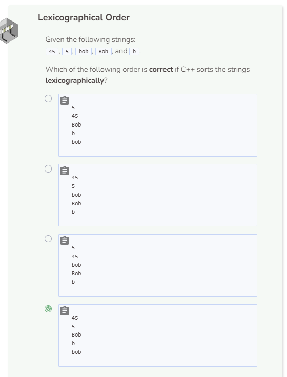
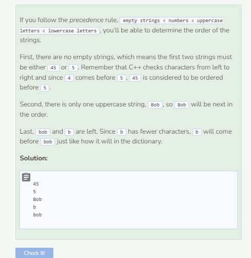

# Compare
## Lexicographical Order
In C++, strings can be compared lexicographically, meaning they can be compared according to how they will appear in the dictionary. You can use the `compare()` method to determine which of two strings comes first. A return value of a negative integer means the first string comes first, a return value of a positive integer means the second string comes first, and a return value of 0 means the strings are equal and neither comes first.

```cpp
string string1 = "apple";
string string2 = "cat";

if (string1.compare(string2) < 0) {
  cout << "string1 comes first" << endl;
}
else if (string1.compare(string2) > 0) {
  cout << "string2 comes first" << endl;
}
else {
  cout << "the strings are equal" << endl;
}
```

## Why Does “10” Come Before "2"?
When C++ compares strings lexicographically, it compares each character of the strings one by one from left to right. Since the first character in `10` is `1`, and `1` comes before `2`, `10` is considered to come before `2` even though numerically `2` is supposed to come first.

```cpp
string string1 = "123";
string string2 = "9";

if (string1.compare(string2) < 0) {
  cout << "string1 comes first" << endl;
}
else if (string1.compare(string2) > 0) {
  cout << "string2 comes first" << endl;
}
else {
  cout << "the strings are equal" << endl;
}
```

## Letters vs. Numbers vs. Empty Strings
Lexicographically speaking, empty strings always come first, followed by numbers, then uppercase letters, and finally lowercase letters.



