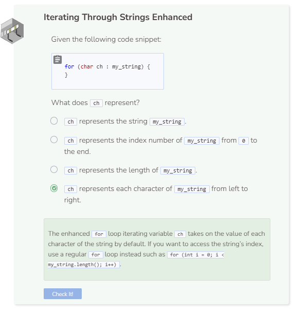

# Lab 1
## Counting Uppercase and Lowercase Characters
You are going to write a program that takes a string and prints out two messages. One message tells you how many uppercase characters are in the string. The other message tells how many lowercase characters are in the string. The program will ignore all numbers and special characters (punctuation, symbols, etc.).

### String Functions
You will need two string functions that were not covered earlier to help with this project:
- `isupper()` - Returns an integer greater than 0 if the character is uppercase, 0 if the character is not.
- `islower()` - Returns an integer greater than 0 if the character is lowercase, 0 if the character is not.

### Variables
You will need three variables for this project. One variable will count all of the lowercase characters, another to count the uppercase characters, and one for the string itself.

```cpp
int lower_count = 0;
int upper_count = 0;
string my_string = "Roses are Red, Violets are Blue";
```

### Iterating Over the String
The next thing to do is iterate over the string and to check each character of the string. A enhanced `for` loop works best.
```cpp
for (char ch : my_string)
```

### Checking for Uppercase and Lowercase
It does not matter if you check for an uppercase character first or check for a lowercase character. Let’s start with lowercase characters. Ask if the character is lowercase and increment the appropriate counting variable.

```cpp
if (islower(ch)) {
  lower_count += 1;
}
```
What you do not want to do is use an `else` statement. This will not give you an accurate count. For example, asking if a special character is lowercase will return 0. However, that does not mean that it is an uppercase character either. Special characters are neither uppercase nor lowercase. So use an else if statement and ask if the character is uppercase. If so, increment the uppercase counting variable.

```cpp
else if (isupper(ch)) {
  upper_count += 1;
}
```

### Print the Results
The final step is to print the messages with the count values.
```cpp
cout << "There are " << lower_count << " lowercase characters." << endl;
cout << "There are " << upper_count << " uppercase characters." << endl;
```
There should be 4 uppercase characters and 21 lowercase characters.


