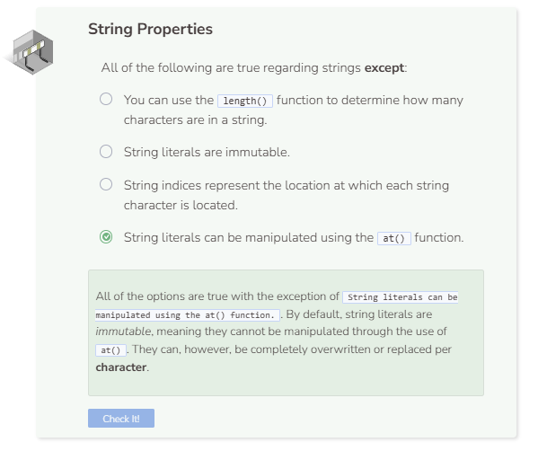

# Lab 2
## Reverse a String
### Variables
All you need for this program is the string variable and a loop to iterate through the string.

```cpp
string my_string = "The brown dog jumps over the lazy fox";
```

### String Iteration
Since we are going to reverse the order of the string, we will need to start at the end of the string and iterate back to the front. Unfortunately, an enhanced `for` loop will not help us in this case because it only iterates from left to right. However, we can still use a regular `for` loop.

The `for` loop should start at the back `my_string.length()-1` and run as long as index is greater than or equal to 0. After each iteration, the iterating variable should also decrement by `1` to allow the loop to reverse.

```cpp
for (int i = my_string.length()-1; i >= 0; i--)
```

Reversing a string comes down to taking the character from the end printing that first, then go backwards. This will be done by accessing the indices with `at()`.

```cpp
my_string.at(i);
```
### Printing the result
All that’s left to do is print. Remember not to include `endl` or the system will print a newline after each character.

```cpp
cout << my_string.at(i);
```

You should see `xof yzal eht revo spmuj god nworb ehT`.




