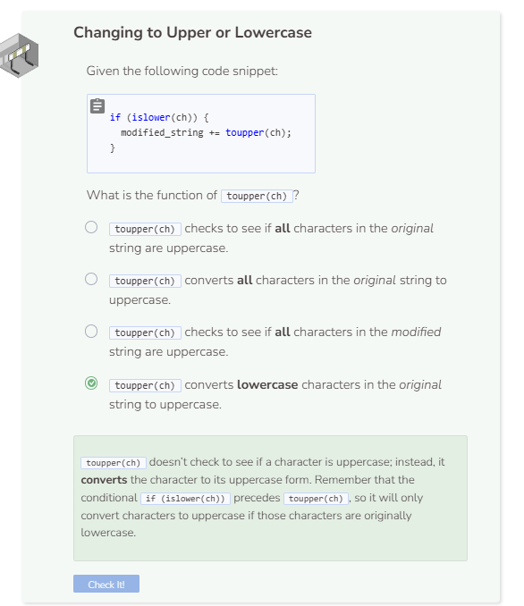

# Lab 3
## Swapping the Case of Characters
You are going to write a program that takes a string and prints a new string where all of the uppercase letters become lowercase, and the lowercase letters become uppercase.

### Variables
You are going to need two string variables. The first string variable represents the original string and the second represents the modified string. For now, the modified string can be empty.
```cpp
string original_string = "THE BROWN DOG JUMPS over the lazy fox!";
string modified_string;
```

### String Iteration
It does not matter if you start at the beginning of the string or the end for iteration. An enhanced `for` loop is the easiest way to iterate through the original_string. Set the iterating variable as `ch`.
```cpp
for (char ch : original_string)
```

### String Functions
You are going to use the `isupper()` and `islower()` functions to test if a character is uppercase or lowercase. In addition, you will be using the `toupper()` and `tolower()` functions to convert characters to their new cases.

### Conditional
For consistency, we will test if a character is lowercase first. However, you may choose to test for uppercase first. It does not matter as long as the conversion is correct.
```cpp
if (islower(ch))
```

If this is true, then append the uppercase version of the character to the variable `modified_string`.
```cpp
modified_string += toupper(ch);
```

If the conditional is false, then append the lowercase version of the character to `modified_string`.
```cpp
else {
  modified_string += tolower(ch);
}
```

You do not need to worry about special characters. Converting them to uppercase or lowercase has no effect.

### Printing the Results
Once the loop has finished, print both the original string and the modified string.

```cpp
cout << "The original string is: " + original_string << endl;
cout << "The modified string is: " + modified_string << endl;
```

You should see the following output:
```
The original string is: THE BROWN DOG JUMPS over the lazy fox!
The modified string is: the brown dog jumps OVER THE LAZY FOX!
```

