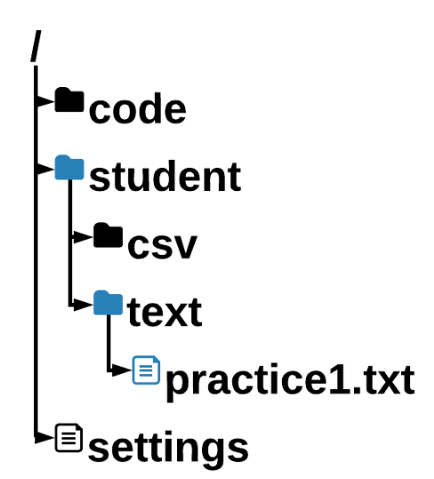
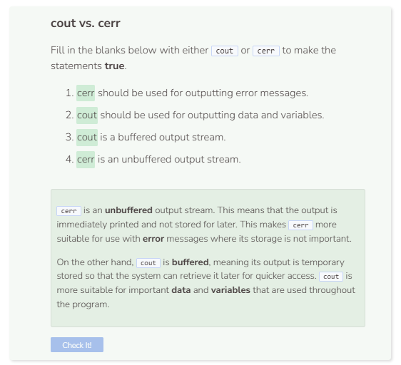

# File Basics
## File Basics
This module is all about working with files on a computer. The first step is to locate the desired file. That means being able to navigate the file system. The file we are going to use is called `practice1.txt`. It is located in the text folder, which is inside the folder called `student`. So the path to the file is: `student/text/practice1.txt`.



Use a string to represent the file path. This string will be passed to direct the system to open a file.

```cpp
string path = "student/text/practice1.txt";
```

## Opening and Closing Files
One of the most common ways to open, close, read, and write files is to use the `ifstream` or `ofstream` data type. The difference between `ifstream` and `ofstream` is that `ifstream` is used to read data from files whereas `ofstream` is used to write to files. Both of these data types can be accessed and utilized by including `#include <fstream>` in the header of your code file. Let’s try to open practice1.txt as specified from above using `ifstream`.

```cpp
string path = "student/text/practice1.txt";

ifstream file;
file.open(path);
```

You’ll see that `Command was successfully executed`. is returned, which isn’t very helpful. To know if the file was opened successfully, you can set up conditions like so:
```cpp
string path = "student/text/practice1.txt";

ifstream file;
file.open(path);
if (file.is_open()) {
  cout << "File successfully opened." << endl;
}
else if (!file.is_open()) {
  cout << "File failed to open." << endl;
}
```

Before your program terminates, it is a best practice to close the file. When a file is opened, it takes up memory that will not free up until the file is properly closed.
```cpp
string path = "student/text/practice1.txt"; // setting file path

ifstream file; //create a read-only data stream
file.open(path); //open the file as a stream
if (file) { //check if file exists
  cout << "File successfully opened." << endl;
}
else if (!file) { //check if file does not exist
  cout << "File failed to open." << endl;
}
file.close(); //close the file
```

## File Error Handling
Below is a basic template of code that returns specified errors to the user when certain actions are not successful. In this case, if the user tries to open a file and that file doesn’t exist (i.e. `try` block), the system will throw an error (i.e. `throw` block), and finally catch and print that error (i.e. `catch` block).
```cpp
string path = "student/text/practice1.txt";

try { //try these actions
  ifstream file;
  file.open(path);
  if (!file) {
    throw runtime_error("File failed to open."); //throw error
  }
  file.close();
  cerr << "File successfully opened and closed." << endl;
}
  
catch (exception& e) { //catch error
  cerr << e.what() << endl;
}
```

**What is cerr?**: When printing error messages, `cerr` is preferred over cout. `cerr` is not bufferred, which means it is not stored in memory to be printed later on. It just gets printed immediately. Therefore, as a rule of thumb, important data and variables should be printed with `cout` while error messages should be printed with `cerr`.

On the other hand, `cout` is buffered, meaning its output is temporary stored so that the system can retrieve it later for quicker access.

