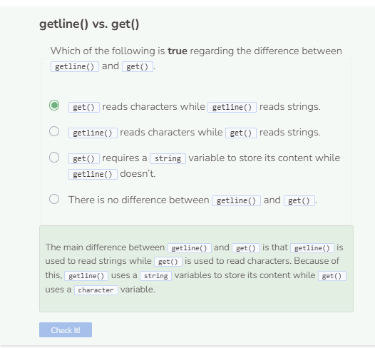

# Reading a File
## Reading a File
Let’s start reading from a file that contains some text. First set the `string path` to `student/text/readpractice.txt`. Then open the file and handle any opening errors. To read from a file, use the `getline()` function. The `getline()` has at least two parameters; the first is the input stream to read from and the second is a string to store what is read.

You’ll notice from above that the system printed `File successfully opened and closed.` first and then `C++ was created by Bjarne Stroustrup.` was printed. This is due to `cerr` being unbuffered, which means it gets printed immediately. `cout` is buffered, so it will store its content into memory before printing, which explains the delay. This doesn’t mean that `cerr` always gets printed first, it just depends on what on quickly `cout` stores its content.

If you take a look at the content of the file, you’ll see that it has more text than just `C++ was created by Bjarne Stroustrup.`. The reason why only one line of text was printed is because `getline()` only reads up until a newline character is reached. To continue to read more lines of text, wrap `getline()` inside a `while` loop.

```cpp
string path = "student/text/readpractice.txt";

try {
  ifstream file;
  string read; //create string to store what is read into
  file.open(path);
  if (!file) {
    throw runtime_error("File failed to open.");
  }
  while (getline(file, read)) {
    cout << read;
  }
  file.close();
  cerr << "File successfully opened and closed." << endl;
}
  
catch (exception& e) {
  cerr << e.what() << endl;
}
```

The `get()` function in the new code works similarly to the `getline()` function. However, `get() `reads character by character instead of by strings.

Additionally, did you notice that `File successfully opened and closed.` was printed at two different locations before and after `<< endl` was added? This all depends on how quickly cerr and cout work behind the scenes. To avoid inconsistencies in printing, we’ll avoid printing the success message moving forward.

```cpp
try {
    ifstream file;
    char ch; //create string to store what is read into
    file.open(path);
    if (!file) {
      throw runtime_error("File failed to open.");
    }
    while (file.get(ch)) {
      cout << ch;
    }
    file.close();
    cerr << "File successfully opened and closed." << endl;
  }
    
  catch (exception& e) {
    cerr << e.what() << endl;
  }
```

