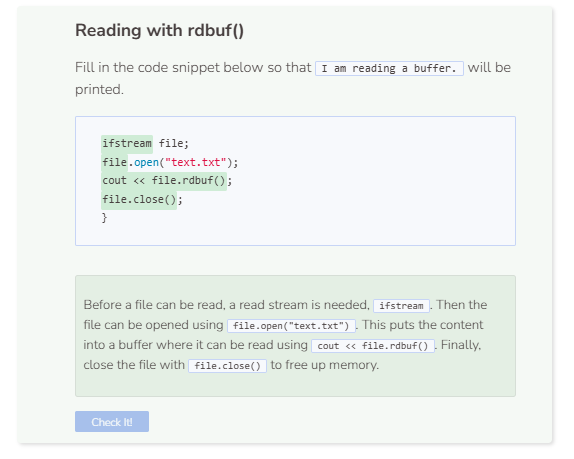

# Reading a Buffer
## The rdbuf() Function
The `getline()` and `get()` functions require a variable to store its content. If all you want to do is to read a file however, then the variable becomes useful and simply takes up extra memory. When a file is opened, its content is buffered or stored in memory until it gets closed. During this buffering stage, you can use the function `rdbuf()` to read the content of the file without having to create any variables.

```cpp
string path = "student/text/readpractice.txt";  

try {
  ifstream file;
  file.open(path); //content of file goes into memory buffer
  if (!file) {
    throw runtime_error("File failed to open.");
  }
  cout << file.rdbuf(); //read the buffered content
  file.close();
}
  
catch (exception& e) {
  cerr << e.what() << endl;
}
```

```
C++ was created by Bjarne Stroustrup.
It serves as an extension to the C language.
The first commercial edition of C++ was released in October, 1985.
Version 20 was released in December, 2020.
The official mascot for C++ is a rat named Keith.
```

If the file is closed, the buffer gets flushed to clear the memory that was used. So after a file is closed, you will not be able to read the buffered content anymore.

