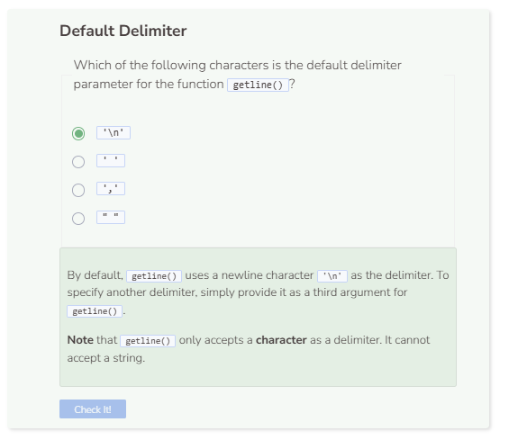

# Delimiters
## Delimiters
Delimiters are a predefined character that separates one piece of information from another. Some common delimiters involve white spaces (`' '`) and commas (`','`). When using `getline()` previously, we only made use of two of its parameters. It actually has a third parameter which is reserved for a delimiter. By default, this delimiter is the newline character (`'\n'`). Thus the parameters for `getline(x, y, z)` are:
- The stream source (x).
- The string variable to store what is read (y).
- The delimiter to separate the content of the stream source (z).
Let’s specify the `getline()` function to use a comma as a delimiter `,`.

```cpp
string path = "student/text/readpractice.txt";

try {
  ifstream file;
  string read;
  file.open(path);
  if (!file) {
    throw runtime_error("File failed to open.");
  }
  getline(file, read, ','); //specify comma as delimiter
  cout << read;
  file.close();
}
  
catch (exception& e) {
  cerr << e.what() << endl;
}
```

When a delimiter is applied, the system will read only up to that delimiter. This is why you only see content up through the first comma occurrence. If you want to continue reading further and get to the other comma occurrences, you can put the command inside a `while` loop.

```cpp
string path = "student/text/readpractice.txt";

try {
  ifstream file;
  string read;
  file.open(path);
  if (!file) {
    throw runtime_error("File failed to open.");
  }
  while (getline(file, read, ',')) { //specify comma as delimiter
    cout << read;
  }
  file.close();
}
  
catch (exception& e) {
  cerr << e.what() << endl;
}
```

The code above continues to read the stream and separates the content via the delimiter, `,`. This is why there are no commas present in the output. However, it doesn’t look very clear that the stream has been separated since the system continues to print the remainder of the stream. You can add `<< endl` to the output so that the system will print a newline after each delimiter is reached so that you can see clearer where the content is separated.

```cpp
string path = "student/text/readpractice.txt";

try {
  ifstream file;
  string read;
  file.open(path);
  if (!file) {
    throw runtime_error("File failed to open.");
  }
  while (getline(file, read, ',')) { //specify comma as delimiter
    cout << read << endl;
  }
  file.close();
}
  
catch (exception& e) {
  cerr << e.what() << endl;
}
```

