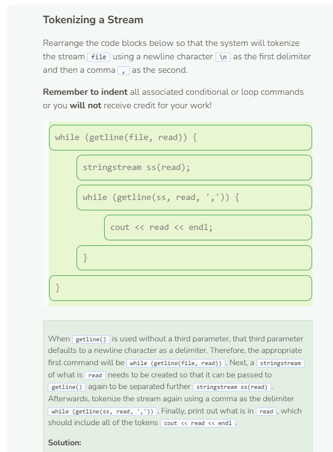
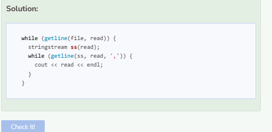

# Tokens
## Tokens
When we apply a delimiter to break up a stream or string, the resulting separated strings are sometimes referred to as tokens. Tokens are useful if you want to use their data for further analysis later on. For example, you can store each token as an element in a vector in which you can extract further information from later on. What do you think the code below does?

```cpp
string path = "student/text/names.txt";
vector<string> names;
string last_name = "Smith";
int count = 0;

try {
  ifstream file;
  string read;
  file.open(path);
  if (!file) {
    throw runtime_error("File failed to open.");
  }
  while (getline(file, read, ' ')) {
    names.push_back(read);
  }
  file.close();
  for (int i = 0; i < names.size(); i++) {
    if (i % 2 == 1) {
      if (names.at(i) == last_name) {
        count++;
      }
    }
  }
  cout << "There are " << count << " people whose last name is Smith." << endl;
}
  
catch (exception& e) {
  cerr << e.what() << endl;
}
```

The code above enables you to do several things:
1. Break the stream into several tokens separated by a white space.
2. Store the tokens into a vector.
3. Iterate through the vector to count how many people have the last name "Smith".
4. Print the resulting count.

Try to search for a first name such as "Jackie" instead?

```cpp
string path = "student/text/names.txt";
vector<string> names;
string first_name = "Jackie"; //change variable to first name
int count = 0;

try {
  ifstream file;
  string read;
  file.open(path);
  if (!file) {
    throw runtime_error("File failed to open.");
  }
  while (getline(file, read, ' ')) {
    names.push_back(read);
  }
  file.close();
  for (int i = 0; i < names.size(); i++) {
    if (i % 2 == 0) { //start checking index 0 and then every other index
      if (names.at(i) == first_name) { //first name found
        count++;
      }
    }
  }
  cout << "There are " << count << " people whose first name is Jackie." << endl;
} //change the print statement as needed

catch (exception& e) {
  cerr << e.what() << endl;
}
```

## Applying Another Delimiter
If you need to further break down your tokens, you can use a nested loop to iterate through those tokens to break them down even further. For example, if your list of names was organized like this:
```
Jason Seymore 
Jackie Simmons 
Jennifer Small 
Jane Smith 
John Smith
```

Then using the code above will cause issues since it only takes a white space as a delimiter, not a newline. To include both the newline and white space as delimiters, you can use a `stringstream` data type (`#include <sstream>`) to create another string stream off of the string variable `read`. The first `getline()` function will separate the stream using a newline as the delimiter and the second getline() will use a white space as a delimiter.

Notice how you get the same result regardless of how your names are organized in the text file.


