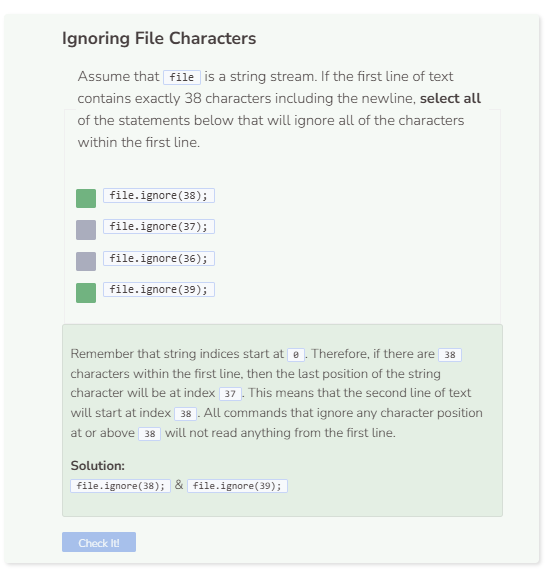

# Ignore Function
## The Ignore Function
The `ignore` function takes an integer as a parameter, and causes C++ to go to a specific character in the text file. The integer is the index for the text file. So `ignore(0)` is the first character of the file, `ignore(1)` is the second character, etc. The code below prints out the entire text file.

```cpp
string path = "student/text/readpractice.txt";

try {
  ifstream file;
  string read;
  file.open(path);
  if (!file) {
    throw runtime_error("File failed to open.");
  }
  while (getline(file, read)) {
    cout << read << endl;
  }
  file.close();
}
  
catch (exception& e) {
  cerr << e.what() << endl;
}
```

Now compare the output above with the output from the code below. C++ will ignore the first 29 characters and start reading only from the character at position `30`.

```cpp
string path = "student/text/readpractice.txt";

try {
  ifstream file;
  string read;
  file.open(path);
  if (!file) {
    throw runtime_error("File failed to open.");
  }
  file.ignore(30); //ignore all chars before index 30
  while (getline(file, read)) {
    cout << read << endl;
  }
  file.close();
}
  
catch (exception& e) {
  cerr << e.what() << endl;
}
```

