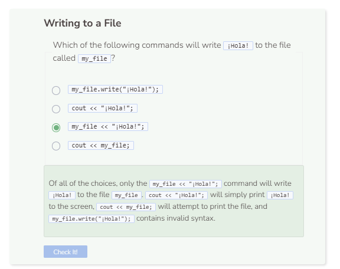

# Writing to a File
## Writing to a File
When writing to a file, you’ll want to use `ofstream` instead of `ifstream`. Like before, create your string path, open the file, and check for whether it can be opened successfully.

```cpp
string path = "student/text/practice1.txt";

try {
  ofstream file;
  file.open(path);
  if (!file) {
    throw runtime_error("File failed to open.");
  }
}
  
catch (exception& e) { //catch error
  cerr << e.what() << endl;
}
```

If the file is successfully opened, you can start writing to the file using the insertion operator `<<` followed by what you want to write in double quotes `""`. Remember to close the file, and if you want, you can print a message at the end telling the user that that the file was successfully written to.

```cpp
string path = "student/text/practice1.txt";

try {
  ofstream file;
  file.open(path);
  if (!file) {
    throw runtime_error("File failed to open.");
  }
  file << "Hello there";
  file.close();
  cerr << "Finished writing to file.";
}
  
catch (exception& e) { //catch error
  cerr << e.what() << endl;
}
```

## Reading a Written File
If you want to read from the file after it was written to, you can create an ifstream to read from the file.

```cpp
string path = "student/text/practice1.txt";

try {
  ofstream file;
  file.open(path);
  if (!file) {
    throw runtime_error("File failed to open.");
  }
  file << "Hello there";
  file.close();
  
  ifstream stream;
  string read;
  stream.open(path);
  while (getline(stream, read)) {
    cout << read << endl;
  }
  stream.close();
}
  
catch (exception& e) { //catch error
  cerr << e.what() << endl;
}
```
