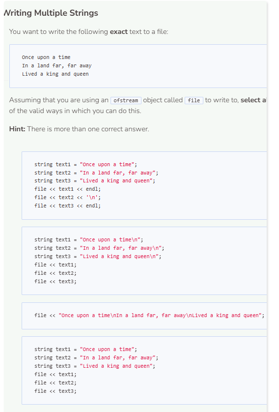
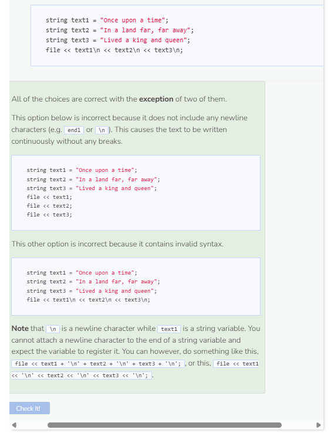

# Multiline Strings
## Multiline Strings
In addition to being able to write and output string literals (e.g. `file << "Hi!";`), we can also write and output the content of variables (e.g. `file << var;`). Let’s tweak the code from the previous page to write multiple messages to a text file called `practice2.txt`. We’ll create three string variables, `text1`, `text2`, and `text3`. The first message will go into a string variable `text1`, the second will go into `text2`, and the third will go into `text3`.

```cpp
string path = "student/text/practice2.txt";

try {
  ofstream file;
  file.open(path);
  if (!file) {
    throw runtime_error("File failed to open.");
  }
  string text1 = "Hello, ";
  string text2 = "your balance is: ";
  string text3 = "12.34";
  file << text1 + text2 + text3;
  file.close();
  
  ifstream stream;
  string read;
  stream.open(path);
  while (getline(stream, read)) {
    cout << read << endl;
  }
  stream.close();
}
  
catch (exception& e) { //catch error
  cerr << e.what() << endl;
}
```

Notice how you can also write the content of other types of data (double, int, etc.) to a file. You are not restricted to just strings. Also, there are multiple ways to write the same kind of content to a file.


