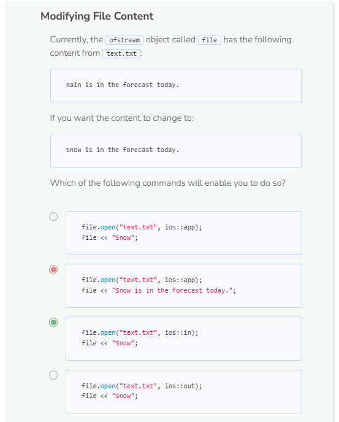
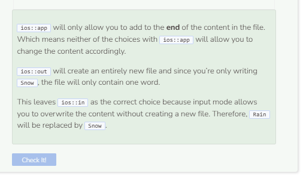

# Appending to a File
## Appending to a File
You may have noticed that every time a file is opened using an `ofstream` object, a new file is always created, even if one already exists (the system just overwrites the existing file). If you want to add to an existing file, you have to tell C++ to open the file in append mode. 

```cpp
string path = "student/text/practice3.txt";

try {
  ofstream file;
  file.open(path, ios::app); //open file in append mode
  if (!file) {
    throw runtime_error("File failed to open.");
  }
  string text = "Adding to the file.";
  file << text;
  file.close();
  
  ifstream stream;
  string read;
  stream.open(path);
  while (getline(stream, read)) {
    cout << read << endl;
  }
  stream.close();
}
  
catch (exception& e) { //catch error
  cerr << e.what() << endl;
}
```
Since there is no `practice3.txt` file at the start of the program, C++ will create one. However, try running the code again and see what happens.

You’ll notice that the output Adding to the file. shows up twice in the file. This happens because we have included the tag `ios::app` as a second parameter when we opened up the file `practice3.txt`. By default, an ofstream object has the flag `ios::out` as a second parameter, which causes the file to always get overwritten. By changing the parameter to `ios::app`, we’re telling the system to add to the file instead of overwriting it.

Notice that when the flag is set to input mode `ios::in`, the system will overwrite the content without creating a new file or overwriting the old one. On the other hand, `ios::app` will add to the end of the existing content. Lastly, `ios::out` creates a completely new file and writes to it.




Explanation from Grok: 

`file.open(path, ios::in);`: Here's where things get interesting. ofstream is an output stream, but according to the C++ standard (as detailed in the documentation for std::basic_ofstream::open), the provided mode is automatically adjusted by OR-ing it with ios::out. So, `ios::in` becomes `ios::in | ios::out`.

This effective mode `(ios::in | ios::out)` opens the file for both reading and writing, similar to `fopen("r+")` in C. Importantly:

- It does not truncate the file (unlike plain `ios::out`).
- The stream position starts at the beginning of the file (position 0).
- It fails (sets the failbit) if the file doesn't exist, but since the file was just created in the first step, it opens successfully.

`if (!file)`: This check passes (no exception thrown) because the open succeeds.
Note: While the mode allows reading, ofstream itself doesn't provide input functions (like `>>` or `getline`), so you couldn't read from it even if you wanted to. But output functions (like `<<`) work fine.

Correct solution

```cpp
#include <iostream>
#include <fstream>
using namespace std;

int main() {
  
  string path = "student/text/practice3.txt";

  try {
    fstream file;              // use fstream
    file.open(path, ios::out); // open file for writing
    if (!file) {
      throw runtime_error("File failed to open.");
    }
    string text = "Rain is in the forecast today.";
    file << text;
    file.close();

    file.open(path, ios::in | ios::out); // reopen with read/write
    if (!file) {
      throw runtime_error("File failed to open.");
    }
    file << "Snow"; // overwrites first 4 characters
    file.close();
    
    ifstream stream;
    string read;
    stream.open(path);
    while (getline(stream, read)) {
      cout << read << endl;
    }
    stream.close();
  }
    
  catch (exception& e) { //catch error
    cerr << e.what() << endl;
  }
  
  return 0;
}
```

There are some “hidden” mechanics in C++ streams that can make things confusing. Technically, nothing stops you from passing ios::in to an ofstream — it won’t give you a compiler error — but it’s not the right way to do it. The proper, standard approach when you want both reading and writing is to use fstream, which is designed to handle input and output. That’s the correction needed here: switch from ofstream to fstream so the code reflects best practices.

As for why "Rain" turns into "Snow": when you reopen the file with ios::in | ios::out, the file pointer starts at the beginning of the file. Writing "Snow" from that position doesn’t insert new text; it simply overwrites the first four characters that were already there. That’s why the original "Rain" is replaced by "Snow" while the rest of the sentence stays the same. 

Normally, opening a file with just ios::out will truncate (clear) the entire file before writing. But because ios::in was (improperly) used with ofstream, truncation didn’t occur, and the write call only replaced characters in place.