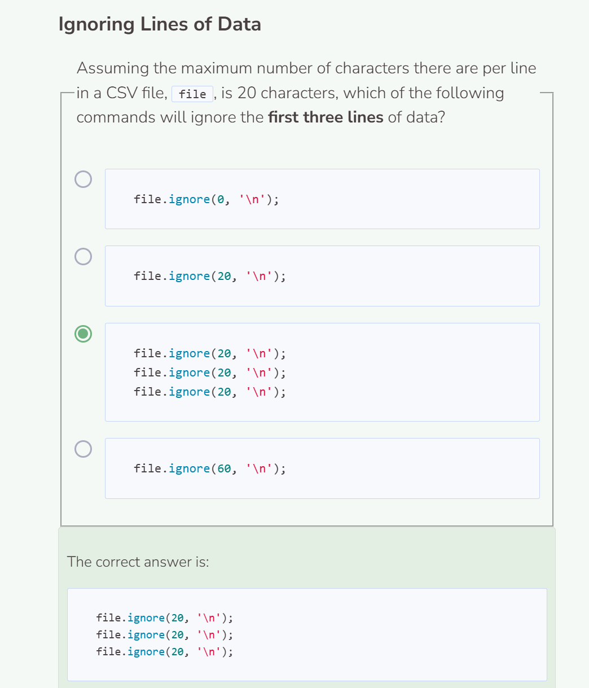

# CSV Files
## CSV Files
C++ can work with files besides just text files. Comma Separated Value (CSV) files are an example of a commonly used file format for storing data. CSV files are similar to a spreadsheet in that data is stored in rows and columns. Each row of data is on its own line in the file, and commas are used to indicate a new column. Here is an example of a CSV file.


You can read a CSV file in the same way you read a text file. First create an `ifstream` object and then open the CSV file using it.

```cpp
string path = "student/csv/monty_python_movies.csv";

try {
  ifstream file;
  string read;
  file.open(path);
  if (!file) {
    throw runtime_error("File failed to open.");
  }
  while (getline(file, read, ',')) {
    cout << read + ' ';
  }
  file.close();
}
  
catch (exception& e) {
  cerr << e.what() << endl;
}
```

```
Movie Title Rating
Monty Python and the Holy Grail 5
Monty Python's Life of Brian 4
Monty Python Live at the Hollywood Bowl 4
Monty Python's The Meaning of Life 5 
```

To iterate through the CSV file, we use `while (getline(file, read, ','))`. Since CSV files contain commas that separate information, we set the delimiter to `','`. Then we print the content by using `cout << read + ' '`. We add a space to separate the tokens from each other since it is not apparent that the information is tokenized from using just `cout << read;`.

```cpp
  string path = "student/csv/monty_python_movies.csv";

  try {
    ifstream file;
    string read;
    file.open(path);
    if (!file) {
      throw runtime_error("File failed to open.");
    }
    while (getline(file, read, ',')) {
      cout << read << endl;
    }
    file.close();
  }
    
  catch (exception& e) {
    cerr << e.what() << endl;
  }
```

```
Movie Title
Rating
Monty Python and the Holy Grail
5
Monty Python's Life of Brian
4
Monty Python Live at the Hollywood Bowl
4
Monty Python's The Meaning of Life
5
```
By using `cout << read << endl;` you can clearly see each token line by line. Depending on your preference, you can choose to arrange the tokens in a variety of different formats.

## Ignoring the Header
The first row of a CSV file is helpful because the header values provide context for the data. However, the first row is not useful if you want to know how many rows of data there are, or to calculate the avg value, etc. Here, you can also use the `ignore()` function to skip a specific number of characters.

```cpp
string path = "student/csv/monty_python_movies.csv";

try {
  ifstream file;
  string read;
  file.open(path);
  if (!file) {
    throw runtime_error("File failed to open.");
  }
  file.ignore(19); //Ignore the first 19 characters from index 0-18
  while (getline(file, read, ',')) {
    cout << read << endl;
  }
  file.close();
}
  
catch (exception& e) {
  cerr << e.what() << endl;
}
```

The `file.ignore(500, '\n');` command tells the system to skip the first 500 characters or up through the newline character `\n`. Since there are fewer than 500 characters, the system will skip everything up through the first occurrence of the newline. You can add additional ignore commands to ignore more lines of data if needed.


