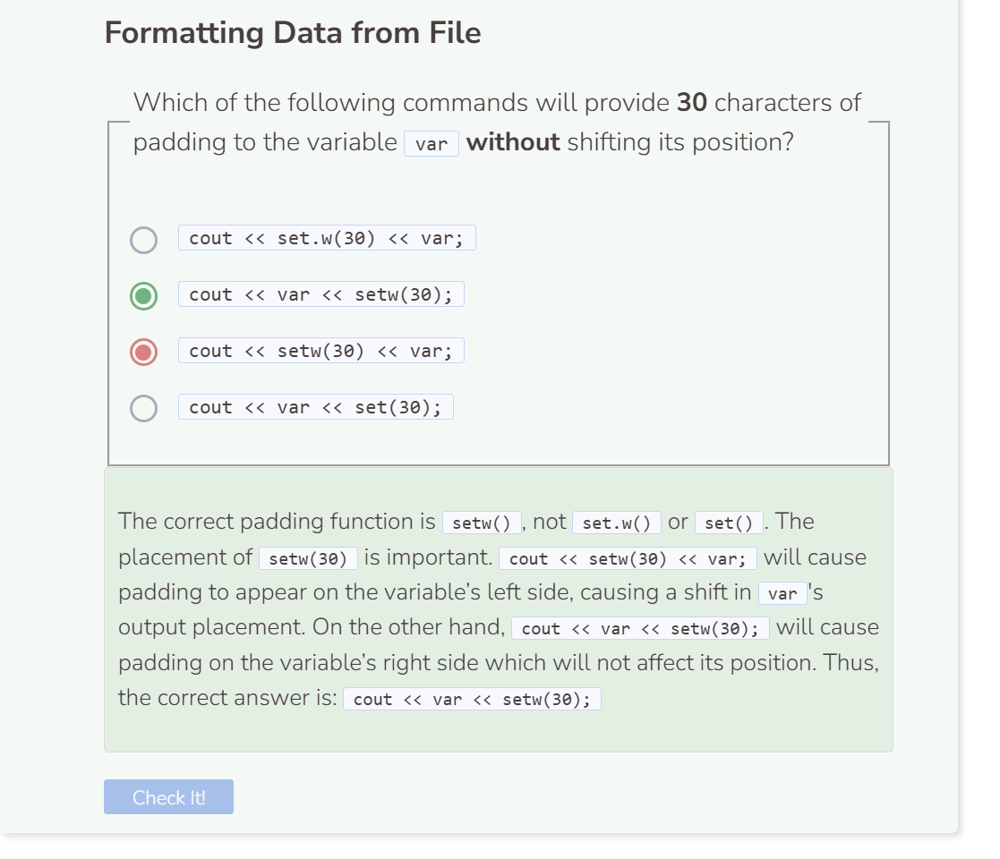

# Printing CSV Data
## Printing CSV Data
Iterating over the CSV file and printing each line does not produce visually pleasing output. The code below produces three columns of data, but there is no consistency in the spacing between columns. When printed, the data looks very disorganized and difficult to read.

```cpp
string path = "student/csv/homeruns.csv";

try {
  ifstream file;
  string read;
  file.open(path);
  if (!file) {
    throw runtime_error("File failed to open.");
  }
  while (getline(file, read, ',')) {
    cout << read + " ";
  }
  file.close();
}
  
catch (exception& e) {
  cerr << e.what() << endl;
}
```

To better organize our CSV data, we can store the data into a vector and then format and print elements in a way that looks more organized.
```cpp
string path = "student/csv/homeruns.csv";
vector<string> data;

try {
  ifstream file;
  string read;
  file.open(path);
  if (!file) {
    throw runtime_error("File failed to open.");
  }
  while (getline(file, read)) {
    stringstream ss(read);
    while (getline(ss, read, ',')) {
      data.push_back(read);
    }
  }
  file.close();
  for (int i = 0; i < data.size(); i++) {
    if (i % 3 == 0) {
      cout << setw(20) << left << data.at(i);
    }
    else if (i % 3 == 1) {
      cout << setw(15) << left << data.at(i);
    }
    else {
      cout << data.at(i) << endl;
    }
  }
}
  
catch (exception& e) {
  cerr << e.what() << endl;
}
```

To organize our data, we use conditionals to split our elements into three columns. `if (i % 3 == 0)` refers to the elements in the first column, `else if (i % 3 == 1)` refers to the second column, and `else` refers to the third. We use the `setw()` function to provide padding for our elements. For example, `setw(20)` means that the system will reserve 20 characters for the elements. If the element does not take up 20 characters, then white spaces will occupy those spaces. To use `setw()`, you’ll need `#include <iomanip>` in the header of your file. The `left` tag forces the element to be aligned to the left side.

```
Player              Home Runs      Active Player
Barry Bonds         762            No
Hank Aaron          755            No
Babe Ruth           714            No
Alex Rodriguez      696            No
Willie Mays         660            No
Albert Pujols       656            Yes
Ken Griffey Jr.     630            No
Jim Thome           612            No
Sammy Sosa          609            No
Frank Robinson      586            No
```

By default, standard streams are set to `right`. This is why deleting all of the left tags will effectively align the streams back to the `right` side. Additionally, you only have to set the `left` tag once for all streams that follow to align `left` as well.

Notice how the last column `Active Player` is not formatted and is therefore unaffected by the changes.

The order or placement of where you use `left` and `setw()` can affect all streams that follow. So it’s important to keep track of the changes that take place as you print.



The correct padding function is `setw()`, not `set.w()` or `set()`. The placement of `setw(30)` is important. `cout << setw(30) << var;` will cause padding to appear on the variable’s left side, causing a shift in `var`'s output placement. On the other hand, `cout << var << setw(30);` will cause padding on the variable’s right side which will not affect its position. Thus, the correct answer is: `cout << var << setw(30);`

