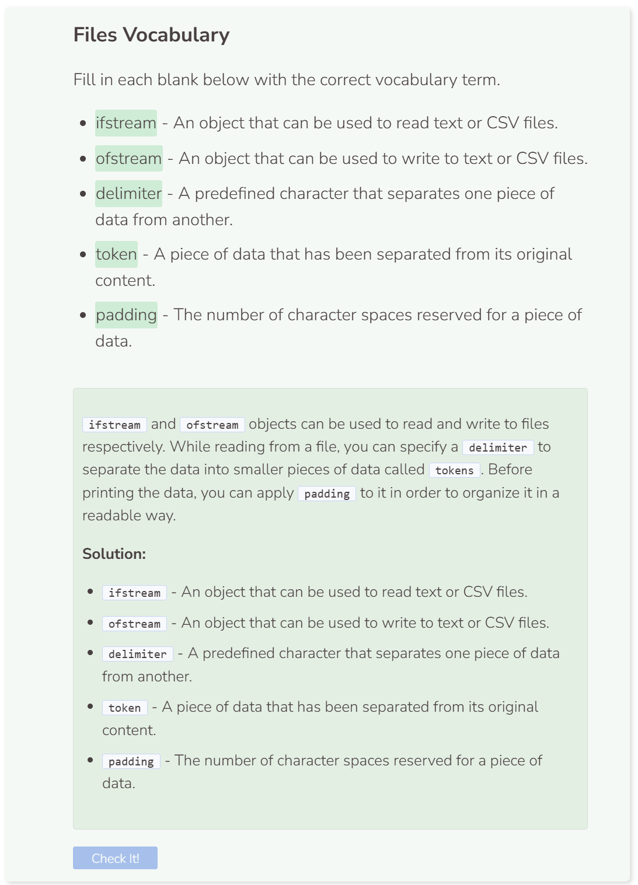

# Writing to CSV Files
## Writing to CSV Files
Writing to a CSV files is similar to writing to a text file. First create an `ofstream` object to open the CSV file. Then you can write to the CSV file using the insertion operator `<<`. To read the CSV file, you can use the same syntax that was previously shown.

```cpp
string path = "student/csv/writepractice.csv";

try {
  ofstream file;
  file.open(path);
  if (!file) {
    throw runtime_error("File failed to open.");
  }
  file << "Greeting,Language" << endl;
  file << "Hello,English" << endl;
  file << "Bonjour,French" << endl;
  file << "Hola,Spanish";
  file.close();
  
  ifstream file2;
  string read;
  file2.open(path);
  while (getline(file2, read, ',')) {
    cout << read + ' ';
  }
  file2.close();
}
  
catch (exception& e) { //catch error
  cerr << e.what() << endl;
}
```

To organize the CSV data, you can add each token into a vector and then use conditionals to format and print the data like before.
```cpp
string path = "student/csv/writepractice.csv";
vector<string> data;

try {
  ifstream file;
  string read;
  file.open(path);
  if (!file) {
    throw runtime_error("File failed to open.");
  }
  while (getline(file, read)) {
    stringstream ss(read);
    while (getline(ss, read, ',')) {
      data.push_back(read);
    }
  }
  file.close();
  for (int i = 0; i < data.size(); i++) {
    if (i % 2 == 0) {
      cout << setw(15) << left << data.at(i);
    }
    else {
      cout << data.at(i) << endl;
    }
  }
}
  
catch (exception& e) {
  cerr << e.what() << endl;
}
```


