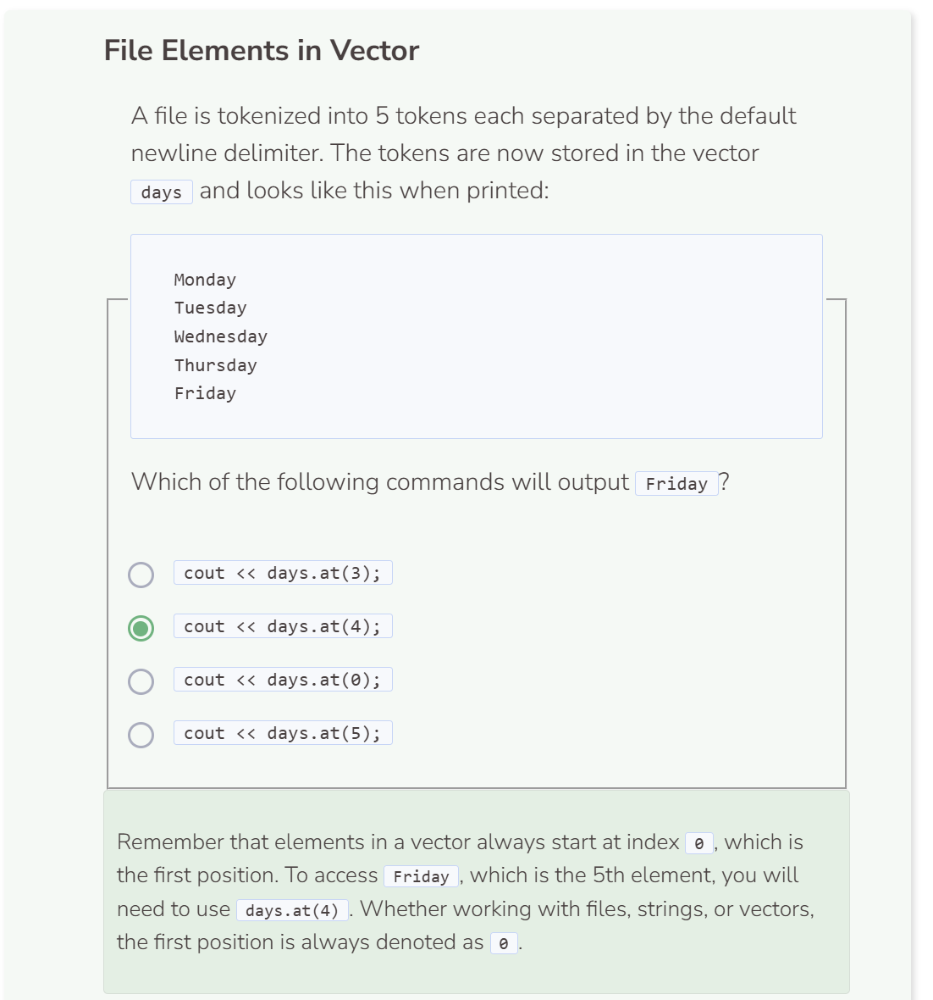

# Lab 1
## Lab 1
As you read a text file, you go line by line until you reach the end of the file. What happens if you want to go back to a specific line of text? A common practice that comes with reading text from a file is to store that information into something like a vector. This way you can easily reference any data obtained from the file.

Before reading the file, create the `path` variable with the file path, and instantiate the string vector `text`.

```cpp
string path = "student/labs/fileslab1.txt";
vector<string> text;
```

Use `try`, `throw` and `catch` blocks to handle input/output exceptions. In the `try` portion, create an `ifstream` object to read through the file and store its content into a string variable. While reading, add each line to the vector text. Print any errors in the `catch` portion. You can optionally print a message that the file has successfully been read, but that is not required.

```cpp
string path = "student/labs/fileslab1.txt";
vector<string> text;

try {
  ifstream file;
  string read;
  file.open(path);
  if (!file) {
    throw runtime_error("File failed to open.");
  }
  while (getline(file, read)) {
    text.push_back(read);
  }
  file.close();
}
  
catch (exception& e) {
  cerr << e.what() << endl;
}
```

The content of the text file now resides in the vector variable `text`. However, the code above only adds text from the file into the vector. To print what was stored in the vector, use a loop to iterate the vector’s elements first followed by the `cout` command.

```cpp
string path = "student/labs/fileslab1.txt";
vector<string> text;

try {
  ifstream file;
  string read;
  file.open(path);
  if (!file) {
    throw runtime_error("File failed to open.");
  }
  while (getline(file, read)) {
    text.push_back(read);
  }
  for (int i = 0; i < text.size(); i++) {
    cout << text.at(i) << endl;
  }
  file.close();
}
  
catch (exception& e) {
  cerr << e.what() << endl;
}
```

You should see a passage from Bram Stoker’s Dracula. You’ll notice, however, that the output is just a collection of text grouped together. In fact, if you were to print the first element in the vector, you will get the same result. The entire file was read and stored as the first element in the vector. This occurs because the default delimiter is a newline and there is only 1 occurrence of a newline at the end of the file.

Let’s change the delimiter into a period `.` so that the text will be tokenized into sentences. Each token will represent one sentence from the passage.

```cpp
string path = "student/labs/fileslab1.txt";
vector<string> text;

try {
  ifstream file;
  string read;
  file.open(path);
  if (!file) {
    throw runtime_error("File failed to open.");
  }
  while (getline(file, read, '.')) { //set delimiter as a period
    text.push_back(read);
  }
  for (int i = 0; i < text.size(); i++) {
    cout << text.at(i) << endl;
  }
  file.close();
}
  
catch (exception& e) {
  cerr << e.what() << endl;
}
```

The passage is tokenized using a period `.` as a delimiter. When the delimiter is specified, the system extracts the period from the text, this is why you do not see the periods in the output. To put the periods back into the vector, simply include `+ '.'` in the `push_back()` statement.

```cpp
string path = "student/labs/fileslab1.txt";
vector<string> text;

try {
  ifstream file;
  string read;
  file.open(path);
  if (!file) {
    throw runtime_error("File failed to open.");
  }
  while (getline(file, read, '.')) {
    text.push_back(read + '.'); //add period to end
  }
  for (int i = 0; i < text.size(); i++) {
    cout << text.at(i) << endl;
  }
  file.close();
}
  
catch (exception& e) {
  cerr << e.what() << endl;
}
```

Your vector now includes 4 elements, each representing a sentence from the passage extracted from the file `fileslab1.txt`. To bring your focus to a particular sentence, you can use the `at()` function and specify the position of the sentence you are interested in.

```cpp
string path = "student/labs/fileslab1.txt";
vector<string> text;

try {
  ifstream file;
  string read;
  file.open(path);
  if (!file) {
    throw runtime_error("File failed to open.");
  }
  while (getline(file, read, '.')) {
    text.push_back(read + '.');
  }
  cout << text.at(1); //print the second element/sentence
  file.close();
}
  
catch (exception& e) {
  cerr << e.what() << endl;
}   
```

To erase the first leading white space, you can use `text.at(1).erase(0, 1)`. This will take the system to the first position, index `0`, and erase just 1 character in that string.

```cpp
string path = "student/labs/fileslab1.txt";
vector<string> text;

try {
  ifstream file;
  string read;
  file.open(path);
  if (!file) {
    throw runtime_error("File failed to open.");
  }
  while (getline(file, read, '.')) {
    text.push_back(read + '.');
  }
  cout << text.at(1).erase(0, 1) << endl; //erase the first string char
  file.close();
}
  
catch (exception& e) {
  cerr << e.what() << endl;
}
```

