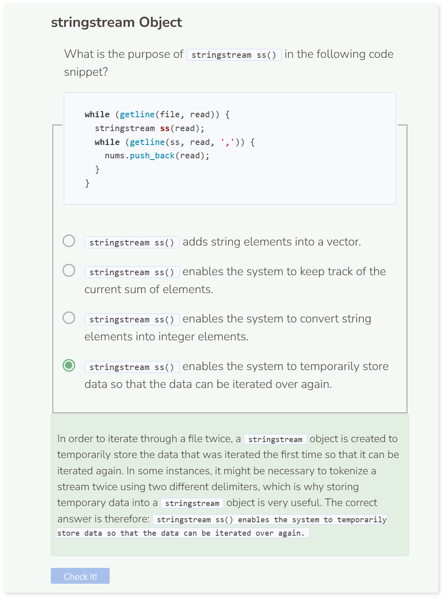

# Lab 2
## Lab 2
This lab uses a comma delimited CSV file `fileslab2.csv`, which contains integers. There are three columns and four rows. The program below will print the sum for each row in the CSV. This is what the file currently looks like:
```csv
1,4,5
18,34,99
0,12,51
37,29,61
```
We’ll start with directing the `path` to the file, creating a vector nums to store the data for later, creating an `ifstream` and `string` to read and hold the content of the file temporarily, and using `try`, `throw` and `catch` blocks to handle any issues when opening the file.
```cpp
string path = "student/labs/fileslab2.csv";
vector<string> nums;

try {
  ifstream file;
  string read;
  file.open(path);
  if (!file) {
    throw runtime_error("File failed to open.");
  }
  file.close();
}
  
catch (exception& e) {
  cerr << e.what() << endl;
}
```

After, use the `getline()` function to iterate through the file and store its content as tokens in the vector. Note that you will need to go through the file twice and include a `stringstream` object to further help tokenize the data. Try running the code below to see what’s currently stored.

```cpp
string path = "student/labs/fileslab2.csv";
vector<string> nums;

try {
  ifstream file;
  string read;
  file.open(path);
  if (!file) {
    throw runtime_error("File failed to open.");
  }
  while (getline(file, read)) {
    stringstream ss(read);
    while (getline(ss, read, ',')) {
      nums.push_back(read);
    }
  }
  for (int i = 0; i < nums.size(); i++) {
    cout << nums.at(i) << endl;
  }
  file.close();
}
  
catch (exception& e) {
  cerr << e.what() << endl;
}
```

You should see a list of numbers after the code runs. Though what you see are numbers, they are currently strings which means we cannot do calculations on them directly. We must convert them into integers first using `stoi()`. Additionally, the data is stored in a vector which is one dimensional but we want to calculate totals for multiple rows. To achieve, we’ll use a double nested `for` loop to iterate through the vector in chunks of three elements which will allow us to calculate the totals of each row.

```cpp
string path = "student/labs/fileslab2.csv";
vector<string> nums;

try {
  ifstream file;
  string read;
  file.open(path);
  if (!file) {
    throw runtime_error("File failed to open.");
  }
  while (getline(file, read)) {
    stringstream ss(read);
    while (getline(ss, read, ',')) {
      nums.push_back(read);
    }
  }
  file.close();
}
  
catch (exception& e) {
  cerr << e.what() << endl;
}

for (int i = 0; i < nums.size(); i+=3) {
  int total = 0;
  for (int j = 0; j < 3; j++) {
    total += stoi(nums.at(i + j));
  }
  cout << "Total: " << total << endl;
}
```

```
Total: 10
Total: 151
Total: 63
Total: 127
```

