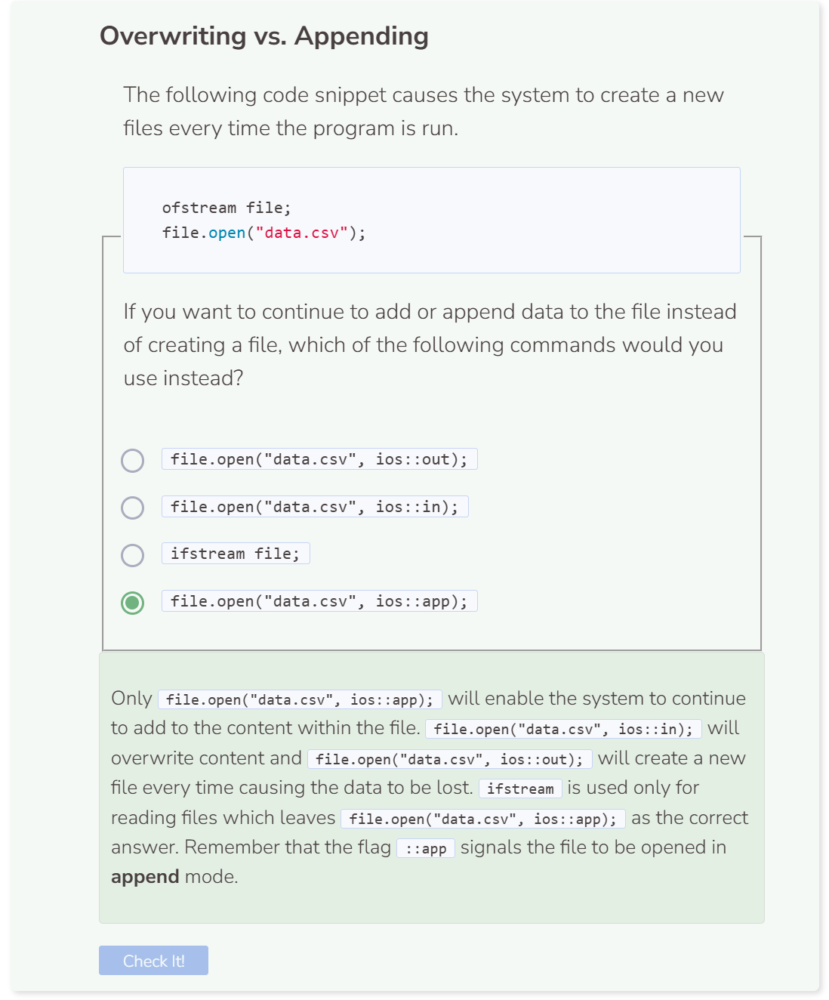

# Lab 3
## Lab 3
The goal of this lab is to rely on user input for data. We are going to continuously ask the user to enter the name of a superhero followed the name of their power. If the user enters lowercase `q`, the system will stop collecting data and write all of the data collected to the CSV file `superheroes.csv`.

First let’s create our `string` path, `ofstream` object, `read` string, and exception blocks like usual.

```cpp
string path = "student/labs/superheroes.csv";

try {
  ofstream file;
  string read;
  file.open(path);
  if (!file) {
    throw runtime_error("File failed to open.");
  }
  file.close();
}
  
catch (exception& e) {
  cerr << e.what() << endl;
}
```

Next, we need to create variables for our user input. Additionally, we also need to continuously ask the user for output until they enter `q`. After `q` is detected, the information entered will be written to our CSV file.

```cpp
string path = "student/labs/superheroes.csv";
string name;
string power;

try {
  ofstream file;
  string read;
  file.open(path);
  if (!file) {
    throw runtime_error("File failed to open.");
  }
  
  while (true) {
    cout << "Please enter a superhero name (or enter q to quit): ";
    cin >> name;
    if (name == "q") {
      break;
    }
    cout << "Please enter a superhero power (or enter q to quit): ";
    cin >> power;
    if (power == "q") {
      break;
    }
    file << name << ',' << power;
  }
  
  file.close();
}
  
catch (exception& e) {
  cerr << e.what() << endl;
}
```

